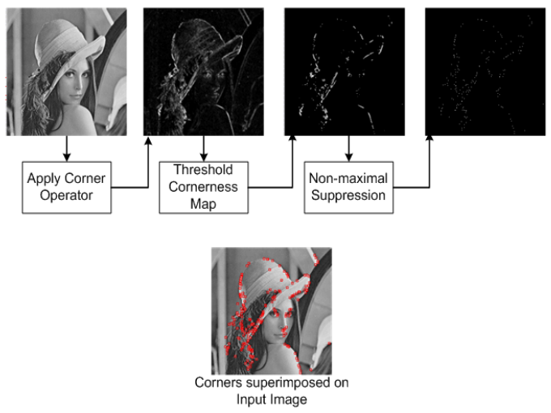

# 第 2 讲 特征点检测

　　常见的图像特征有点，线，区域，模版特征等。本节介绍特征点检测算法，Moravec 算子和 Harris 算子。无论是点还是区域，它们都属于局部特征，下面先介绍局部特征的特点。

　　特征点是重要的局部特征，包括角点、线交叉点、不连续点、轮廓上曲率最大点，封闭曲线或区域的质心等。**特征点**在图像中一般有具体的坐标，**并具有某些数学特征，如局部最大或最小灰度、以及某些梯度特征等**。**角点**可以简单的认为是两条边的交点，比较严格的定义则是**在邻域内具有两个主方向的特征点，也就是说在两个方向上灰度变化剧烈**。

　　不同于 HOG、LBP、Haar 等基于区域(Region)的图像局部特征，**Harris 是基于角点的特征描述子，属于 feature detector，主要用于图像特征点的匹配(match)，在 SIFT 算法中就有用到此类角点特征**；而 HOG、LBP、Haar 等则是通过**提取图像的局部纹理特征(feature extraction)，用于目标的检测和识别等领域**。无论是 HOG、Haar 特征还是 Harris 角点都属于图像的**局部特征**，满足局部特征的一些特性。主要有以下几点：

* **可重复性(Repeatability)**：同一个特征可以出现在不同的图像中，这些图像可以在不同的几何或光学环境下成像。也就是说，**同一物体在不同的环境下成像(不同时间、不同角度、不同相机等)，能够检测到同样的特征**。
* **独特性(Saliency)**：特征在某一特定目标上表现为独特性，能够与场景中其他物体相区分，能够达到后续匹配或识别的目的。
* **局部性(Locality)**；特征能够刻画图像的局部特性，而且对环境影响因子(光照、噪声等)鲁棒。
* **紧致性和有效性(Compactness and efficiency)**；特征能够有效地表达图像信息，而且在实际应用中运算要尽可能地快。

　　相比于考虑局部邻域范围的局部特征，**全局特征则是从整个图像中抽取特征，较多地运用在图像检索领域，例如图像的颜色直方图**。除了以上几点通用的特性外，对于一些图像匹配、检测识别等任务，可能还需进一步考虑**图像的局部不变特征**。例如**尺度不变性(Scale invariance)和旋转不变性(Rotation invariance)**，当图像中的物体或目标发生旋转或者尺度发生变换，依然可以有效地检测或识别。此外，也会考虑局部特征对光照、阴影的不变性。

　　下图是特征点检测的流程图：

　　 

　　这里解释一下上图中几个操作：

* 首先是对原图应用角点检测算子（Corner Operator），得到角点响应图（Cornerness Map）；
* 然后对响应图做阈值化（Threshold），得到阈值化之后的结果（Thresholded Map）；
* 最后对阈值图做非极大值抑制，也就是只取极大值，找特征最明显的那个点；

　　
