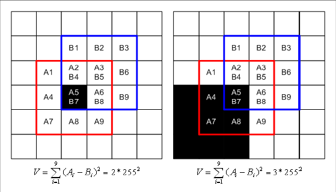
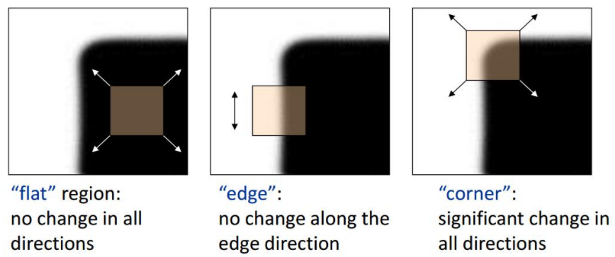
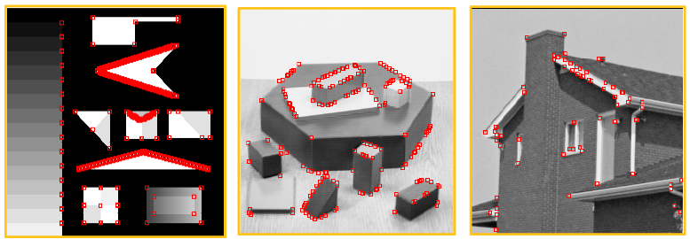
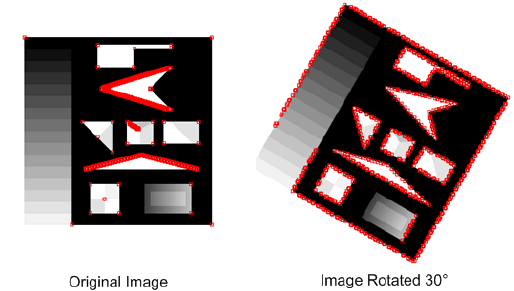

# 2.1 Moravec 算子

# 1. 算法流程

　　参考资料：[手写计算机视觉算法：Moravec 角点检测算子](http://zhaoxuhui.top/blog/2019/01/10/MoravecCornerDetection.html#1moravec%E7%AE%97%E5%AD%90%E4%BB%8B%E7%BB%8D)

　　首先计算滑动窗口计算角点响应值。比如下图中红框代表 $I(x,y)$，蓝框代表 $I(x+1, y+1)$，$A_5$ 就是我们的目标像素点，黑色代表像素值为 255，白色代表为 0。我们以 45 度方向为例，计算 $A_5$ 的 45 度方向上的兴趣值，做法是这两个框对应位置的像素值相减取平方之和。只有 $A_7-B_7, A_5-B_5$ 有两个 255 的值，所以结果是 $2 * 255^2$。这只是 45 度一个方向上的，类似地方向一共有 8 个，计算出这 8 个 $V$ 取最小的作为像素角点响应值 CRF：

$$
CRF = min(V_1,V_2,...,V_8)
$$

　　

　　然后是对 CRF 阈值筛选获得候选角点，也就是 Threshold，最后做局部非极大值抑制（Non-Maximum Supression,NMS）获得最终角点，这是为了防止相邻两点由于灰度值差别不大而检测到多余的角点，这个过程和上面是一致的。

# 2. 算法评价

## 2.1 对边缘点的反应比较强烈

　　

　　如上图所示，在各个方向上移动小窗口，如果任何方向都不变化，则是均匀区域（Flat）；如果灰度只在一个方向上变化，则可能是图像边缘（Edge）；如果在所有方向上移动，窗口内灰度都发生变化，则认为是角点（Corner）。

　　

　　观察上图中第一张图：尽管 Moravec 算子把所有角点都检测出来了，但是把边缘上面的很多点也作为角点了，比如中间的三角形边上有很多角点。Moravec 算法对角点定义是：窗口在各个方向的移动，窗口内的灰度值都会产生较大的变化。而其实这里的“各个方向“，也就只有 8 个方向。所以**如果边缘的方向是这 8 个方向以外的方向，那么在计算过程中边缘方向上所有点的值都会特别大，所以边缘上的所有点都会被认为是角点**。

## 2.2 不具备旋转不变性

　　

　　正因为 Moravec 算法只计算最多八个方向的灰度值差的平方和，所以可能会出现原来的一条边缘在这 8 个方向之上而旋转之后却不在了，也有可能是相反的情况。这种旋转不变性进一步抑制了 moravec 算法的实用性。观察上图就能看到旋转后的图像特征点检测出现了很大不同

　　**改进**：限制 Moravec 算子的正是检测方向只有 8 个，那么可以改成 `u, v` 分量的合成，这样就能检测任意方向。也就是下面的 Harris 算子。

　　
