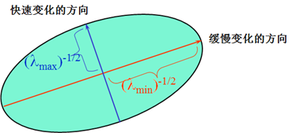
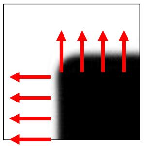
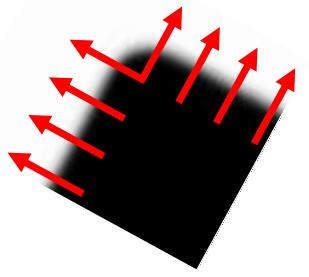
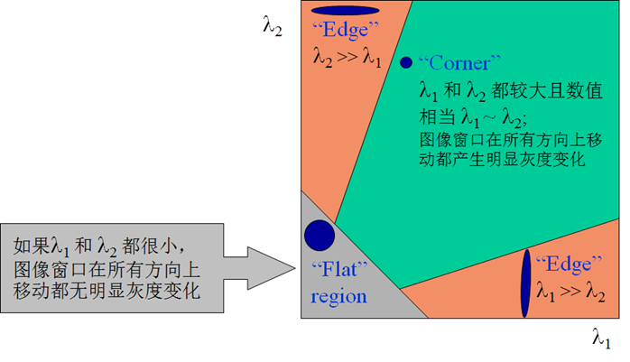
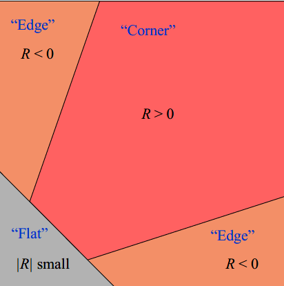
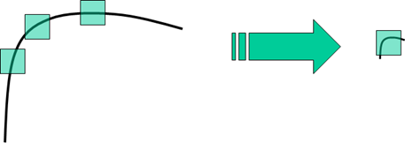
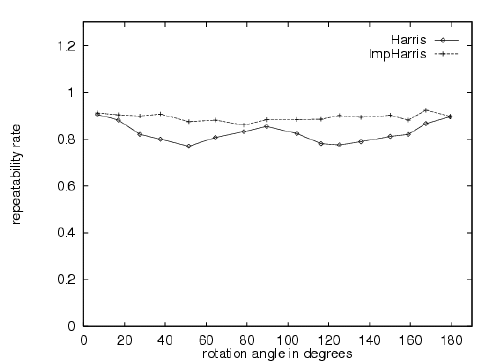
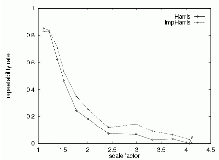

# 2.2 Harris 算子

# 1. 算法流程

　　参考资料：[图像特征之 Harris 角点检测（侧重数学推导）](https://senitco.github.io/2017/06/18/image-feature-harris/)，[手写计算机视觉算法：Harris 角点检测算子（侧重理论分析）](http://zhaoxuhui.top/blog/2019/01/23/HarrisCornerDetection.html)

　　定义能量函数：$E(u, v) = \sum \limits_{x,y} W(x, y) [I(x+u, y+v) - I(x, y)]^2$ ，其中 $W(x, y)$ 代表权值，可以取均值函数或者高斯函数（Harris 采用二维高斯分布的权重，使得形成了一个圆形窗口。离中心越近的像素权重越大，而离中心越远，权重越小，这个细节可以参考第二个参考资料中的分析）。

　　我们先对 $I(x+u, y+v)$ 在 $(x-u,y-v)$ 处做泰勒展开，然后将结果代入能量函数表达式。

$$
\begin{align}
\because f(x) &= f(x_0) + \frac{f^{'}(x_0)}{1!}(x-x_0) + \frac{f^{''}(x_0)}{2!}(x-x_0)^2 + \cdots + \frac{f^{(n)}(x_0)}{n!}(x-x_0)^n \\
\therefore I(x+u, y+v) &= I(x, y) + [I_x (x - (x - u)) + I_y (y - (y - v))] + \cdots \approx I(x, y) + I_x u + I_y v \\

\end{align}
$$

　　之后我们可以把这个表达式代入到 $E(u,v)$ 中：

$$
\begin{align}
E(u, v) &= \sum \limits_{x,y} W(x, y) [I(x, y) + I_x u + I_y v - I(x, y)]^2 \\
&= \sum \limits_{x,y} W(x, y) [I_x u + I_y v]^2 \\
&= \sum \limits_{x,y} W(x, y) [I_x^2 u^2 + 2 I_x I_y u v + I_y^2 v^2]^2 \quad (二次型，写成矩阵形式)\\
&= \sum \limits_{x,y} W(x, y) \begin{bmatrix}
u & v
\end{bmatrix}  \begin{bmatrix}
I_x^2  & I_x I_y \\
I_x I_y & I_y^2
\end{bmatrix} \begin{bmatrix}
u \\
v
\end{bmatrix} \\
&= \begin{bmatrix}
u & v
\end{bmatrix} M \begin{bmatrix}
u \\
v
\end{bmatrix} \\
M &= \sum \limits_{x,y} W(x, y) \begin{bmatrix}
I_x^2  & I_x I_y \\
I_x I_y & I_y^2
\end{bmatrix} = \begin{bmatrix}
A  & C \\
C & B
\end{bmatrix} \\
\therefore E(u,v) &= Au^2+2Cuv+Bv^2
\end{align}
$$

　　其中 $A=\Sigma_{x,y} W(x,y) I_x^2, B = \Sigma_{x,y} W(x,y) I_y^2, C=\Sigma_{x,y} W(x,y) I_x I_y$ 。上述表达式为一个二次项函数，本质上是一个椭圆函数，椭圆的曲率和尺寸可由 $M(x,y)$ 的特征值 $\lambda_1, \lambda_2$ 决定，椭圆方向由 $M(x,y)$ 的特征向量决定，椭圆方程和其图形分别如下所示：

$$
\begin{align}
\left[u,v\right] M(x,y) \left[ \begin{matrix} u\\ v\end{matrix} \right] = 1
\end{align}
$$

　　

　　接下来就要尝试着用特征值和特征向量来表示 $M$ 以求进一步化简。**考虑角点的边界和坐标轴对齐的情况**，如下图所示，在平移窗口内，只有上侧和左侧边缘，上边缘偏导 $I_y$ 很大而 $I_x$ 偏导很小，左边缘反之。

　　

$$
\begin{align}
M=\left[ \begin{matrix} \lambda_1& 0\\ 0& \lambda_2\end{matrix} \right]
\end{align}
$$

　　**当角点边界和坐标轴没有对齐时**，可对角点进行旋转变换，将其变换到与坐标轴对齐，这种旋转操作可用矩阵的相似对角化来表示，即：

$$
\begin{align}
M &= X \cdot \Sigma \cdot X^T,\quad \Sigma = \begin{bmatrix}
\lambda_1 & 0 \\
0 & \lambda_2
\end{bmatrix} \\
 令S^T &= \begin{bmatrix}
u & v
\end{bmatrix}, \quad E(u,v) = S^T \cdot (X \cdot \Sigma \cdot X^T) \cdot S = S^{'T} \cdot \Sigma \cdot S^{'}
\end{align}
$$

　　

　　我们讨论这种不对齐的情况，令 $E(u,v) = 1$ ，再将其展开可得：

$$
\begin{align}
E(u,v) &= S^{'T} \cdot \Sigma \cdot S^{'} = \begin{bmatrix}
u^{'} & v^{'}
\end{bmatrix}  \begin{bmatrix}
\lambda_1 & 0 \\
0 & \lambda_2
\end{bmatrix} \begin{bmatrix}
u^{'} \\
v^{'}
\end{bmatrix} \\
&= \lambda_1 (u^{'})^2 + \lambda_2 (v^{'})^2 = 1
\end{align}
$$

　　最后发现：角点需要满足上面这个椭圆方程，长轴为 $\frac{2}{\sqrt{\lambda_2}}$ ，短轴为 $\frac{2}{\sqrt{\lambda_1}}$ 。$\lambda_{1,2}$ 和 $I_{x,y}$ 是相关的，所以两个“Edge”区域正是边缘平行于 XY 轴的情况；“Corner”  
区域是两个偏导数都有变换且值较大。

　　

　　上述的过程比较麻烦，为了简化我们定义 $R = \det{M} - \alpha (trace(M))^2$ ，通过计算 $R$ 来判断角点的情况，$\alpha$ 为一常数，通常取值为 0.04~0.06 。

$$
\begin{align}
detM &= \lambda_1 \lambda_2=AB-C^2 \\
traceM &=\lambda_1 + \lambda_2 = A+B
\end{align}
$$

　　在“Edge”区域时，$A,B$ 中有一个很大，另一个很小，也就是 $\lambda$ 中一个大一个小，所以 $detM$ 趋于零，所以 $R$ 的值为负值；“Corner”区域两个值都很大，所以为正值。

　　

# 2. 流程总结

　　第一，计算图像 $I(x,y)$ 在 X 方向和 Y 方向的梯度（利用卷积计算离散值，和拉普拉斯算子比较像）；

$$
\begin{align}
I_x &=\dfrac {\partial I} {\partial x}=I(x,y)\otimes \left( \begin{matrix} -1& 0& 1\end{matrix} \right) \\
I_y &=\dfrac {\partial I} {\partial y}=I(x,y)\otimes \left( \begin{matrix} -1& 0& 1\end{matrix} \right)^T
\end{align}
$$

　　第二，计算图像两个方向梯度的乘积 $I_x^2, I_y^2, I_x I_y$ ；

　　第三，使用窗口高斯函数 $W(x,y)$ 分别对 $I_x^2, I_y^2, I_x I_y$ 进行高斯加权，生成矩阵 $M$ ；

　　第四，计算每个像素的 Harris 响应值 $R$，并设定一阈值 $T$，对小于阈值 $T$ 的 $R$ 置零；

　　第五，在一个固定窗口大小的邻域内(5×5)进行非极大值抑制，局部极大值点即为图像中的角点。

# 3. Harris 角点的性质

* 参数 $\alpha$ 对角点检测的影响：增大 $\alpha$ 的值，将减小角点响应值 $R$，减少被检测角点的数量；减小 $\alpha$ 的值，将增大角点响应值 $R$，增加被检测角点的数量。
* Harris 角点检测对亮度和对比度的变化不敏感。
* **Harris 角点检测具有旋转不变性，但不具备尺度不变性**。如下图所示，当 Harris 算子确定后，框的大小也就确定了，在小尺度（右图）下的角点被放大后（左图）可能会被认为是图像边缘，所以**检测出的角点随着尺度的增加而急剧下降**。

　　

　　对于旋转不变性，我们定义可重复率（Repeatability rate）为 Correspondences 和 Possible Correspondences 相除。那如何得到可重复率呢？比如有 1000 张图像，让其乘以旋转矩阵 R 后对旋转后的新图做检测；对原图上的检测结果做旋转后的结果作为真值，两个结果不可能严丝合缝对应，所以可以判断欧式距离在一定范围内就认为是相同的，这样就得到了重复的点。

　　

　　对于尺度我们和上面一样检测可重复率，图像如下图所示，可重复率在 0.25 以下几乎不可用。

　　

　　但是将 Harris 角点检测算子和高斯尺度空间表示相结合，可有效解决这个问题，这里参见第一个参考链接中的内容。
