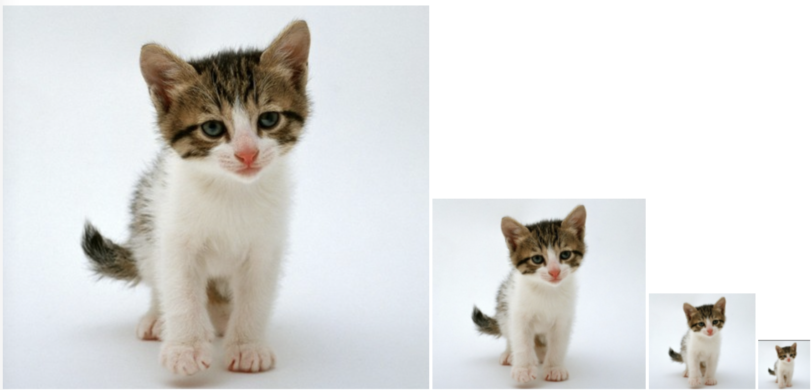
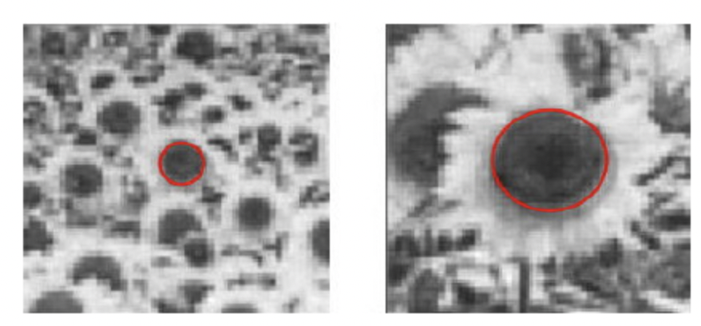

# 3.1 尺度空间

　　参考资料：[尺度空间理论](https://www.cnblogs.com/ronny/p/3886013.html)

# 1. 特征不变性

　　每个物体，我们总可以用一些词语或部件来描述它，比如人脸的特征：两个眼睛、一个鼻子和一个嘴巴。对于图像而言，我们需要计算机去理解图像，描述图像就需要计算机去取得图像的特征，对图像比较全面的描述即一个二维矩阵，矩阵内的每个值代表图像的亮度。有时候我们需要**让计算机更简化的来描述一个图像，抓住一些显著特征**，这些特征要具有一些良好的性质，比如局部不变性。局部不变性一般包括两个方面：尺度不变性与旋转不变性。

* **尺度不变性**：人类在识别一个物体时，不管这个物体或远或近，都能对它进行正确的辨认，这就是所谓的尺度不变性。尺度空间理论经常与生物视觉关联，有人也称图像局部不变性特征为基于生物视觉的不变性方法。
* **旋转不变性**：当这个物体发生旋转时，我们照样可以正确地辨认它，这就是所谓的旋转不变性。

# 2. 局部不变特征

　　**全局特征**：从整个图像中抽取的特征。较多的运用在图像检索领域，如图像颜色直方图。

　　**局部特征**：从图像的局部区域中抽取的特征（这个局部区域往往是图像中的一个像素及它周围的邻域）。一种好的局部特征应该具有下面的特性：

1. 可重复性：同一个物体在不同时间，不同角度拍到图像中，检测到的特征对应的越多越好。
2. 独特性：特征在该物体上表现为独特性，能与场景下其他物体区分。
3. 局部性：特征往往是物体某个局部的特点，这样才可以避免遮挡时不能匹配的问题。
4. 数量性：检测到的特征数目一定要多，密集度最好能在一定程度上反映图像的内容。
5. 准确性：得到的特征应该能被精确定位，能够精确到像素。
6. 高效性：特征检测算法运算要快。

　　为了研究图像的尺度不变特征，我们需要先从图像的尺度空间理论开始。

# 3. 图像尺度空间理论

　　当用一个机器视觉系统分析未知场景时，计算机没有办法预先知识图像中物体尺度，因此我们**需要同时考虑图像在多尺度下的描述，获知感兴趣物体的最佳尺度**。

　　所以在很多时候，**我们会将图像构建为一系列不同尺度的图像集，在不同的尺度中去检测我们感兴趣的特征**。比如在 Harris 特征检测人脸的时候，因为我们并不知道图像中人脸的尺寸，所以需要生成一个不同大小的图像组成的金字塔，扫描其中每一幅图像来寻找可能的人脸。

## 3.1 图像金字塔

　　图像金字塔化的一般步骤：

* **高斯卷积**：图像经过一个低通滤波器进行平滑（这个步骤会使图像变模糊，**模仿人距离目标物体越来越远的过程**）；
* **降采样**：对这个平滑后的图像进行抽样（一般抽样比例在水平和竖直方向上都为 1/2），从而得到一系列的缩小的图像。

　　

　　通过了解 SIFT 算法，我们知道降采样实际上是变相增加了高斯卷积的 $\sigma$ 的值（2 倍关系），这里并没有考虑尺度的连续性。

　　假设高斯金字塔有 $N$ 层，第 $l$ 层图像为 $G_l$，其行数和列数为 $(R_l,\ C_l)$，那么任意一点的像素值为：

$$
\begin{array}{c}
G_{l}(i, j)=\sum_{m=-2}^{2} \sum_{n=-2}^{2} \omega(m, n) G_{l-1}(2 i+m, 2 j+n) \\
\\
\left(1 \leq l \leq N, 0 \leq i \leq R_{l}, 0 \leq j \leq C_{l}\right)
\end{array}
$$

　　式中的 $\omega (m, n)$ 便是高斯卷积核，此时其维度为 $5 \times 5$ ，在计算过程中可以把二维窗口的卷积算子可以写成两个方向上的一维卷积核（二项核）的乘积。上面卷积形式的公式实际上完成了 2 个步骤：

* 高斯模糊：也就是用做卷积操作；
* 降维：通过指定卷积操作的对象，使尺寸缩小了一倍。

　　按上述步骤生成的 $G_0,G_1,…,G_N$ 就构成了图像的高斯金字塔，其中 $G_0$ 为金字塔的底层(与原图像相同)，$G_N$ 为金字塔的顶层。可见高斯金字塔的当前层图像是对其前一层图像先进行高斯低通滤波 $\omega (m, n)$ ，然后做隔行和隔列的降采样  $G_{l-1} (2i+m, 2j+n)$ 对上一张图的偶数行与偶数列做操作而生成的。当前层图像的大小依次为前一层图像大小的 1/4。

## 3.2 拉普拉斯金字塔

　　将 $G_l$ 进行内插（**这里内插用的不是双线性而是用的与降维时相同的卷积核**）得到放大图像 $G_l^∗$，使 $G_l^∗$ 的尺寸与 $G_l−1$ 的尺寸相同，表示为：

$$
\begin{aligned}
G_{l}^{*}(i, j) &=4 \sum_{m=-2}^{2} \sum_{n=-2}^{2} \omega(m, n) G_{l}\left(\frac{i+m}{2}, \frac{j+n}{2}\right) \\
(0&\left.\leq l \leq N, 0 \leq i \leq R_{l}, 0 \leq j \leq G_{l}\right)
\end{aligned}
$$

　　式中，

$$
G_l(\frac{i+m}{2},\frac{j+n}{2})=\begin{cases} 
G_l(\frac{i+m}{2},\frac{j+n}{2}), & 当\frac{i+m}{2},\frac{j+n}{2}为整数时 
\\ 
0, & 其他 
\end{cases}
$$

　　记拉普拉斯金字塔中第 $l$ 层的图像为 $LP_l$ ，定义如下：

$$
\begin{cases} 
LP_l=G_l-G_{l+1}^{\ast}, & 当0 \le l \le N时 \\ 
LP_N=G_N, & 当l=N时 
\end{cases}
$$

　　观察这个定义，$G_{l+1}^{\ast}$ 是第 $G_{l+1}$ 层图像内插放大为和第 $G_l$ 层相同尺寸的图像。从 $G_l \rightarrow G_{l+1}$ 尺寸变小，代表由近及远的两个不同尺度；内插的作用就是把远处尺度的信息“拉伸到”近处尺度；**近处尺度减去远处尺度便能得到图像的轮廓信息**。

　　由 $LP_0,LP_1, \dots,LP_l,\dots,LP_N$ 构成的金字塔称为**拉普拉斯金字塔**。

## 3.3 为什么用高斯核

　　图像的金字塔化能高效地（计算效率也较高）对图像进行多尺度的表达，但它缺乏坚实的理论基础，**不能分析图像中物体的各种尺度（虽然我们有小猫的金字塔图像，我们还是不知道原图像内小猫的大小）**。

　　信号的尺度空间刚提出是就是通过一系列单参数、宽度递增的高斯滤波器将原始信号滤波得到到组低频信号。那么一个很明显的疑问是：除了高斯滤波之外，其他带有参数 t 的低通滤波器是否也可以用来生成一个尺度空间。

　　后来 Koenerink、Lindeberg[Scale-space theory in computer vision]、Florack 等人用精确的数学形式通过不同的途径都证明了高斯核是实现尺度变换的唯一变换核。

　　Young 对经生理学的研究中发现，**哺乳动物的视网膜和视觉皮层的感受区域可以很好地用 4 阶以内的高斯微分来建模**。

　　虽然很多研究者从可分性、旋转不变性、因果性等特性推出**高斯滤波器是建立线性尺度空间的最优滤波器**。然后在数字图像处理中，需要对核函数进行采样，离散的高斯函数并不满足连续高斯函数的的一些优良的性质。所以后来出现了一些非线性的滤波器组来建立尺度空间，如 B 样条核函数。

　　使用高斯滤波器对图像进行尺度空间金塔塔图的构建，让这个尺度空间具有下面的性质：

### （1）加权平均和有限孔径效应

　　信号在尺度 t 上的表达可以看成是原信号在空间上的一系列加权平均，权重就是具有不同尺度参数的高斯核。

　　信号在尺度 t 上的表达也对应于用一个无方向性的孔径函数（特征长度为 $\sqrt{\sigma}=t$）来观测信号的结果。这时候信号中特征长度小于 $\sigma$ 的精细结构会被抑制，理解为一维信号上小于 $\sigma$ 的波动会被平滑掉。

### （2）层叠平滑

　　也叫高斯核族的半群（Semi-Group）性质：两个高斯核的卷积等同于另外一个不同核参数的高斯核卷积：

$$
g(\mu,\sigma_1)\ast g(\mu,\sigma_2)=g(\mu,\sqrt{\sigma_1^2+\sigma_2^2})
$$

　　这个性质的意思就是说不同的高斯核对图像的平滑是连续的。

### （3）局部极值递性

　　这个特征可以从人眼的视觉原理去理解，人在看一件物体时，**离得越远，物体的细节看到的越少，细节特征是在减少的**。

　　高斯核对图像进行滤波具有压制局部细节的性质。

### （4）尺度伸缩不变性

　　对原来的信号加一个变换函数，对变换后的信号再进行高斯核的尺度空间生成，新的信号的极值点等特征是不变的。

## 3.4 尺度的选择

　　一般我们采集到的图像中，我们并不知道我们感兴趣的目标在图像中的尺度，在这样的情况下，我们对图像进行分析时就无法选择合适的参数，比如边缘检测，可能由于参数不当，而造成过多的局部细节。

　　**红色圆圈内的斑点的大小（直径）比例对应着两幅图像之间尺度比例（scale ratio）**。如果对两幅图像采用相同的固定尺度的 LoG 检测器检测，很难将这两个斑点检测出来。**LoG 检测器相当于一个匹配滤波器，只有当 LoG 的尺度与图片中斑点结构尺度相当时才会有较强的响应**。如果用与左图中斑点结构相当大小尺度 LoG 算子，在右图中的大斑点的对应的 LoG 响应很小便不能被检测出来，反之亦然。因此固定尺度的 LoG 斑点检测器不具有尺度不变性。

　　使用尺度空间进行多尺度检测可以将两幅图像中不同尺度的斑点检测出来。但是**由于斑点结构是在一定尺度范围之内存在的**，比如用 5~8 尺度的 LoG 可能都能检测出来右边图像中的斑点结构，所以**在尺度空间中进行斑点检测会有重复检测的缺点**。

　　

　　
