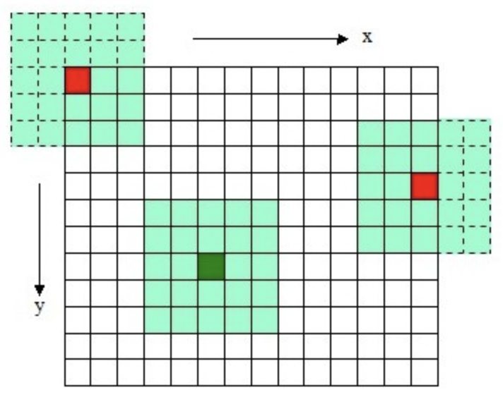
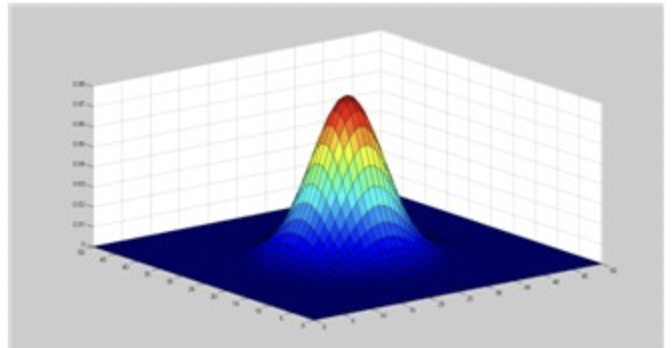
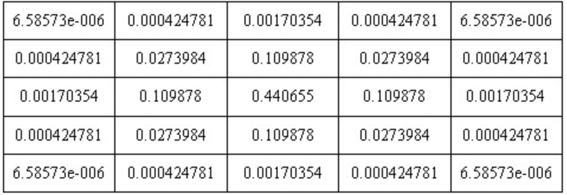
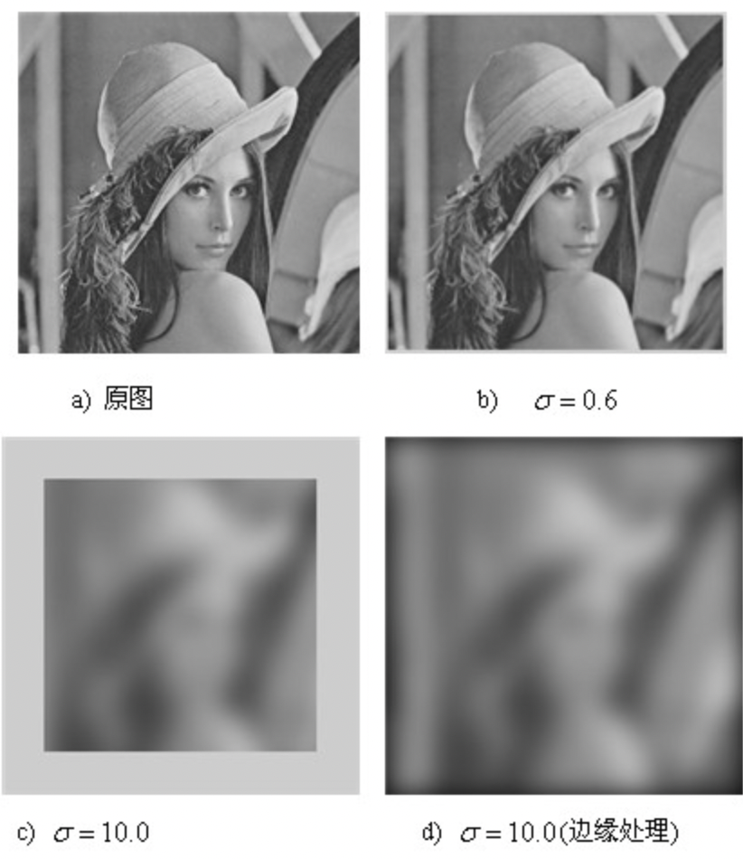
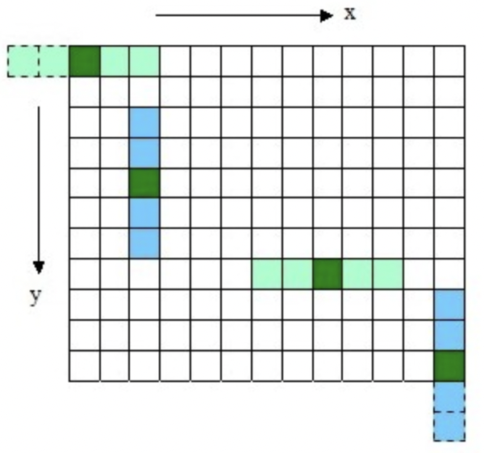
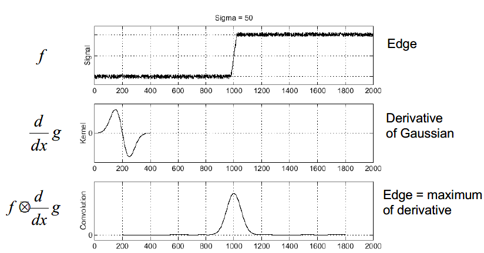
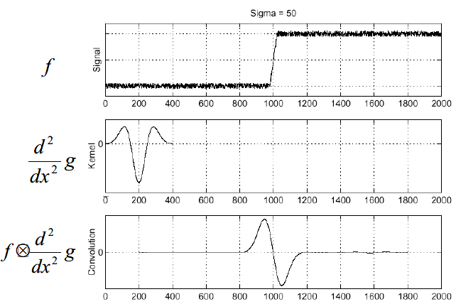
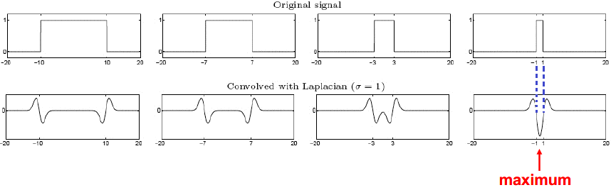
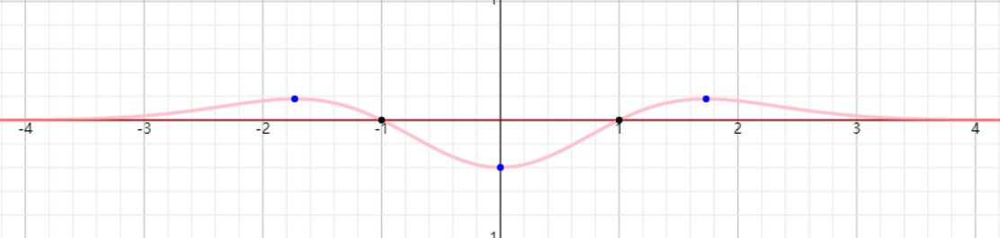
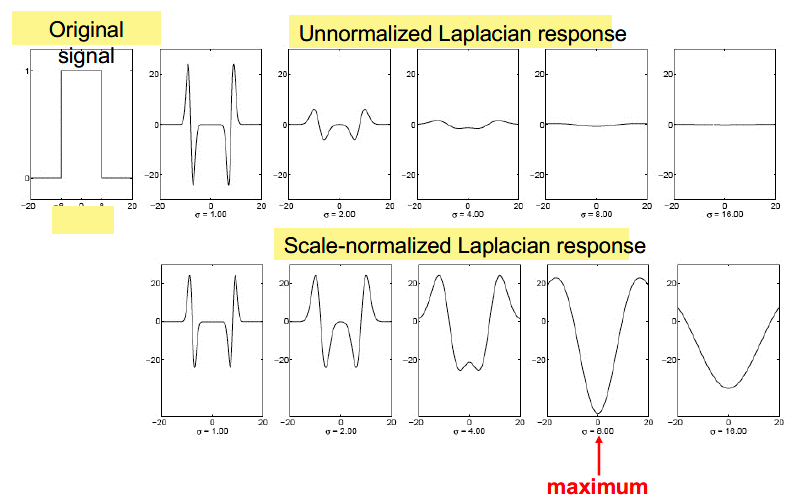

# 3.2 高斯模糊和信号边缘检测

# 1. 图像的卷积

　　

　　图中浅绿色的矩形框（5*5）我们称为**卷积核**，有时也称为**模版**。把卷积核的中心（深绿色/深红色）放在图像的像素点的位置，然后对应位置的元素值相乘并相加，作为图像此位置的像素值。

　　对于信号的卷积来说，定义式为：$f(x) * g(x) = \sum f(\tau) \cdot g(l - \tau)$ ，先把某个信号反转，开始相乘并相加，作为此时点的值。

　　最常用的是高斯卷积核，在尺度空间中，因为**高斯卷积核产生的效果是最接近于人眼效果的**，所以是**唯一一个可以产生多尺度空间的核**。

# 2. 高斯模糊

## 2.1 定义

　　高斯模糊基于正态分布（高斯函数）。$N$ 维空间的高斯函数为 $G(r) = \frac{1}{\sqrt{2 \pi \sigma^2}^N}e^{-\frac{r^2}{2 \sigma^2}}$ ，其中 $\sigma$ 称为标准差，其越大表示图像越模糊（平滑）。$r$ 称为模糊半径，这个和卷积核有关，代表模版中的元素到模版中心的距离。

　　比如对于二维模版大小为 $m*n$ ，则有 $r = \sqrt{(x - \frac{m}{2})^2 + (y - \frac{n}{2})^2}$ ，也就是模版的欧氏距离，此时 $G(x,y) = \frac{1}{2 \pi \sigma^2}e^{-\frac{(x - \frac{m}{2})^2 + (y - \frac{n}{2})^2}{2 \sigma^2}}$ 。

| $(\frac{m}{2} - 1, \frac{n}{2} - 1)$, 2 | $(\frac{m}{2} - 1, \frac{n}{2})$, 1 | $(\frac{m}{2} - 1, \frac{n}{2} + 1)$, 2 |
| :-----------------------------------------: | :-------------------------------------: | :-----------------------------------------: |
|    $(\frac{m}{2}, \frac{n}{2}-1)$, 1    |   $(\frac{m}{2}, \frac{n}{2})$, 0   |    $(\frac{m}{2}, \frac{n}{2}+1)$, 1    |
|   $(\frac{m}{2}+1, \frac{n}{2}-1)$, 2   |  $(\frac{m}{2}+1, \frac{n}{2})$, 1  |   $(\frac{m}{2}+1, \frac{n}{2}+1)$, 2   |

　　上表中代表的是点的坐标位置和它距模版中心的距离。把这个距离值代入高斯函数的表达式就能算出每个位置的值了。

　　在二维空间中，这个公式生成的曲面的等高线是从中心开始呈正态分布的同心圆，如图所示，$z = g(x,y)$ 

　　

　　分布不为零的像素组成的卷积矩阵与原始图像做变换。每个像素的值都是周围相邻像素值的加权平均。原始像素的值有最大的高斯分布值，所以有最大的权重，相邻像素随着距离原始像素越来越远，其权重也越来越小。这样进行模糊处理比其它的均衡模糊滤波器更高地保留了边缘效果。

　　理论上来讲，图像中每点的分布都不为零，这也就是说每个像素的计算都需要包含整幅图像。在实际应用中，在计算高斯函数的离散近似时，在大概 $3\sigma$ 距离之外的像素都可以看作不起作用，这些像素的计算也就可以忽略。通常，图像处理程序只需要计算 $(6 \sigma + 1)(6 \sigma + 1)$ 的矩阵就可以保证相关像素影响。比如下面是 $\sigma = 0.6$ 时的高斯模版：

　　

　　可见中心处的权值为 0.440655 为最大值，周围是对称递减的。使用高斯模版对于图像处理的效果如下所示：

　　

## 2.2 分离高斯模糊

　　使用二维高斯模糊对于图像进行处理有两个缺点：计算量随着 $\sigma$ 或图像尺寸的增加而增大； $\sigma$ 越多，缺失的像素越多，丢弃模版会造成黑边。所以引入高斯函数的**可分离性**。

　　

　　使用二维矩阵变换得到的效果也可以通过**在水平方向进行一维高斯矩阵变换加上竖直方向的一维高斯矩阵变换得到**。

　　从计算量来看，$m*n$ 为高斯矩阵的维数，$M*N$ 为二维图像的维数，则分离后一行的计算量 $O(N*n)$ ，则所有行的计算量为 $O(N*n*M)$ ，类似的所有列的计算量为 $O(M*m*N)$ ，总体的计算量为两者相加。如果直接计算其复杂度为 $O(M*N*m*n)$ 。

　　另外，两次一维的高斯卷积将消除二维高斯矩阵所产生的边缘。对用模板矩阵超出边界的部分（上图虚线框所示），将不做卷积计算。如图中 $x$ 方向的第一个模板 $1*5$，将退化成 $1*3$ 的模板，只在图像之内的部分做卷积。

# 3. 信号的边缘检测

## 3.1 阶跃信号

　　

　　把 $f(x)$ 中从 0 到 1 的阶跃可以认为是“**边缘**”，如何检测这个边缘呢？我们用一维高斯函数  的导函数：

$$
\begin{align}
G(x) &= \frac{1}{\sqrt{2 \pi}\sigma}e^{-\frac{x^2}{2 \sigma^2}} \\
\frac{d}{dx}G(x) &= \frac{1}{\sqrt{2 \pi}\sigma}e^{-\frac{x^2}{2 \sigma^2}} \cdot (-\frac{2x}{2 \sigma^2}) = -\frac{1}{\sqrt{2 \pi} \sigma ^3}e^{-\frac{x^2}{2 \sigma^2}}
\end{align}
$$

　　那么我们尝试使用二阶导 $\frac{d^2}{dx^2} G$ 来和信号做卷积，会有何效果呢？

　　

　　在边缘点处为零点，这个特性可以全局通用，所以我们就**用二阶高斯导和信号的卷积，寻找过零点来做边缘检测**。

　　由于卷积微分定理 $D(f \otimes g) = D(f) \otimes g = f \otimes D(g)$ ，卷积和微分的顺序可以互换，所以上图可以写成：

$$
\begin{align}
f \otimes \frac{d^2}{dx^2} G = f \otimes \nabla ^2(G) = \nabla^2(f \otimes G)
\end{align}
$$

## 3.2 门函数

　　图像的边缘更多是指像素值发生突变处，**边缘是有一定宽度的**，也就是说上面的信号**从阶跃函数变成了门函数，从检测阶跃变成了检测这个门函数**，那么这个问题如何处理？我们仍然让门函数和二阶高斯导去卷积，结果如下所示。

　　

　　对于不同宽度的门函数，我们用固定 $\sigma = 1$ 的二阶高斯导（也就是一维的拉普拉斯算子 $\frac{\partial ^2 f}{\partial x^2}$，没有对 Y 方向上的二阶导）去卷积。我们发现，**在门函数宽度为 1 时（这里的宽度是指正半轴的长度，不是整个门的宽度）卷积的结果有一个最大值**。

　　把不同宽度的门函数看成不同的尺度，$\sigma$ 代表描述尺度的一个参数，那么当 $\sigma$ 和信号的宽度相同时，此时两者的尺度相同，所以响应强烈。

　　上图中蓝色虚线：结果中负值部分的宽度和我们门函数的宽度是一致的，也和下图中一维高斯函数二阶导的两个零点（$\pm 1$）的宽度是一致的。

　　

　　反过来说，假如我们不知道门函数的宽度，需要找一个适合宽度的门函数来使卷积结果有极小值，那只能把门函数放在 $[-1, 1]$ 之间，此时积分值最小。所以当知道二阶高斯导时，也就是知道 $\sigma$ 时，我们就知道了最佳的门函数的宽度。这个思想在后面 LoG 中是很重要的。

## 3.3 拉普拉斯算子

　　**图像是个二维信号，所以需要把求一维信号二阶导变成对二维信号求二阶导，也就是拉普拉斯算子**。

　　图像是个离散的二维信号，我们需要先定义离散导数。

$$
\begin{align}
\frac{\partial^{2} f}{\partial x^{2}} &= f(x+1, y)+f(x-1, y)-2 f(x, y) \\
\frac{\partial^{2} f}{\partial y^{2}} &= f(x, y+1)+f(x, y-1)-2 f(x, y) \\
\Rightarrow \nabla^{2} f &= \frac{\partial^{2} f}{\partial x^{2}} + \frac{\partial^{2} f}{\partial y^{2}} \\
&= [f(x+1, y)+f(x-1, y)+f(x, y+1)+f(x, y-1)]-4 f(x, y)
\end{align}
$$

　　这意味着，我们可以构造一个卷积核，来完成对点 $(x,y)$ 处拉普拉斯的求解。常用的 `filter mask` 有：

$$
\begin{align}
M_1 = \begin{bmatrix}
0 & 1 & 0 \\
1 & -4 & 1 \\
0 & 1 & 0
\end{bmatrix},& M_2 = \begin{bmatrix}
1 & 1 & 1 \\
1 & -8 & 1 \\
1 & 1 & 1
\end{bmatrix}
\\
M_3 = \begin{bmatrix}
0 & -1 & 0 \\
-1 & 4 & -1 \\
0 & -1 & 0
\end{bmatrix},& M_4 = \begin{bmatrix}
-1 & 1 & -1 \\
1 & 8 & -1 \\
-1 & 1 & -1
\end{bmatrix}
\end{align}
$$

　　比如用矩阵 $M_1$ 去和某个像素点做卷积，得到的结果正是上面的式子，这个式子的特点是只有上下左右四个垂直方向临近的像素点。如果加上斜方向上四个点，相当于临近的 7 个点都用上，结果就是 $M_2$ 。而 $M_3$ 和 $M_4$ 是两种变形，和这两者没区别。

## 3.4 尺度规范化的拉普拉斯响应

　　

　　对上面的宽度为 8 的信号，理论上使用 $\sigma = 8$ 的拉普拉斯算子就能检测出来，但是实际上在 $\sigma = 8$ 处曲线几乎是平的，如上图所示。原因在后面具体推导中可见，因为拉普拉斯算子 $\nabla ^ 2$ 表达式有 $\frac{1}{\sigma^4}$ 的衰减项，因为求了二阶导，我们乘以 $\sigma^2$ 来恢复幅度，这个过程称为尺度规范化。

　　

　　我们为了简化后面的推导过程，往往忽略这个尺度规范值。但是在实际应用中不要忘了。
