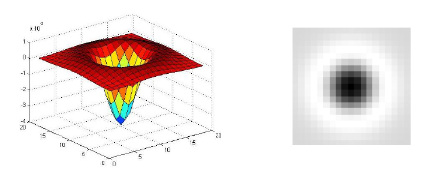
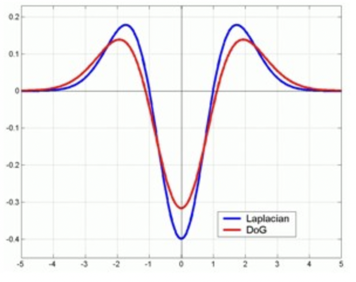

# 3.3 尺度空间的极值检测：LoG 和 DoG

　　尺度空间用高斯金字塔来描述。Tony Lindeberg 指出尺度规范化的 LoG(Laplacion of Gaussian) 算子具有真正的尺度不变性，Lowe 使用高斯差分金字塔近似 LoG 算子，在尺度空间检测稳定的关键点。

# 1. LoG 算子

　　从信号边缘检测部分已知：$f \otimes \frac{d^2}{dx^2} G = f \otimes \nabla ^2(G) = \nabla^2(f \otimes G) = 0$ 就能检测出值的突变点。那么如果把 $f$ 换成图像 $I(x,y)$ 呢？相当于一维变成二维，此时这个结论就意味着，**我们可以先对图像做高斯模糊，然后对处理过的图像求拉普拉斯算子，就能找到当前尺度下的响应点**。

　　LoG 算子可由 GoG 高斯梯度函数算子构建，$\nabla^2 G = \frac{\partial^2 G}{\partial x^2} + \frac{\partial^2 G}{\partial y^2}$ ，可得尺度规范化的 LoG 算子：$\sigma^2 \nabla^2 G$ 。接下来就是用 LoG 算子和图像进行卷积操作。

　　由于求导和卷积操作可以互换顺序，定义 $ L(x,y,\sigma) = G(x,y,\sigma) \otimes I(x,y)$ 对图像进行高斯模糊，一方面进行平滑去噪，另一方面高斯函数中的 $\sigma$ 不同，代表不同尺度空间的图像。**我们把这一系列的 $L(x,y,\sigma)$ 称为原图像的一个尺度空间表示**。那接下来就是要对这个 $L(x,y,\sigma)$ 求拉普拉斯算子，就能找到当前尺度下的响应点。

　　注意区分：LoG 算子和 $L(x,y,\sigma)$ ，前者直接和图像卷积就能得到最后结果，后者需要求拉普拉斯变换。

　　二阶高斯函数表达式为：$G(x,y) = \frac{1}{2 \pi \sigma^2}e^{-\frac{x^2 + y^2}{2 \sigma^2}}$ ，其二阶偏导和图像为：

$$
\begin{align}
\nabla^2 G &= \frac{\partial^2 G}{\partial x^2} + \frac{\partial^2 G}{\partial y^2} = -\frac{1}{2 \pi \sigma ^4}e^{-\frac{x^2 + y^2}{2 \sigma^2}}(2 - \frac{x^2 + y^2}{\sigma^2}) \\
&= \frac{1}{2 \pi \sigma ^6}e^{-\frac{x^2 + y^2}{2 \sigma^2}}(x^2 + y^2 - 2\sigma^2)
\end{align}
$$

　　

　　二维高斯二阶导 $\nabla^2 G$ 的图像如上左图所示，如果沿 $z = 0$ 做水平横切，沿平行于 X 或 Y 轴方向观察，会发现和一维高斯二阶导的图像是一致的；右图是一幅经过左侧高斯卷积后的图像，即这幅图像现在的尺度为 $\sigma$。

　　现在我们要做的是：在右图中找一个合适半径的圆圈，也就是找一个圆形区域，使这个区域内的 $\nabla^2 (I \otimes G)$ 有极小值。

　　解决这个问题有两个思路，代表两个不同的公式。

　　对 $\nabla^2 (I \otimes G)$ ，因为拉普拉斯算子算的是两个方向上的梯度，所以找梯度最大之处，那从右侧的图像中可以看出，梯度最大的是黑白交界处。

　　对 $I \otimes \nabla^2 G$ ，就要从"3.2 门函数"[^1]（一维）拓展到图像（二维），一维时当门函数宽度和二阶高斯导零点之间的宽度相同时，卷积结果有极大值。观察 $\nabla^2 G(x,y)$ 图像，如果圆形在 $\nabla^2 G = 0$ 那一圈时，由于 $\nabla^2 G$ 内部的值都是负的，此时结果最小，然后再把图像中像素值较大较集中的那一片找出来，两个相乘自然得到了极小值。

$$
\begin{align}
\because \nabla^2 G &= 0 \\
\therefore x^2 + y^2 &= 2 \sigma^2 \\
\therefore r = \sqrt{x^2 + y^2} &= \sqrt{2} \sigma
\end{align}
$$

# 2. DoG 算子

　　LoG 的计算需要二维高斯卷积和拉普拉斯比较复杂，那如何近似替代呢？

$$
\begin{align}
\frac{\partial G(x,y)}{\partial \sigma} = \frac{1}{2 \pi \sigma ^5}e^{-\frac{x^2 + y^2}{2 \sigma^2}}(x^2 + y^2 - 2 \sigma^2) &= \sigma \nabla^2 G  \approx \frac{G(x,y,k\sigma) - G(x,y,\sigma)}{k\sigma - \sigma} \\
\therefore G(x,y,k\sigma) - G(x,y,\sigma) &= (k -1) \sigma^2 \nabla^2 G
\end{align}
$$

　　我们发现：在 LoG 的基础上乘以 $(k-1)\sigma^2$ 就能变成两个尺度下的高斯函数之差。所以定义**高斯差分算子** DoG ：$G(x,y,k\sigma) - G(x,y,\sigma)$ 。

$$
\begin{align}
D(x,y,\sigma) &= [G(x,y,k\sigma) - G(x,y,\sigma)] \otimes I(x,y) \\
&= L(x,y,k\sigma) - L(x,y,\sigma)
\end{align}
$$

　　$L(x,y,\sigma)$ 的作用是对图像做高斯模糊，$D(x,y,\sigma)$ 的作用是得到了两个高斯模糊图像之间的差。有关**两个算子**的图像对比：

　　

[^1]: ## 3.2 门函数

    图像的边缘更多是指像素值发生突变处，**边缘是有一定宽度的**，也就是说上面的信号**从阶跃函数变成了门函数，从检测阶跃变成了检测这个门函数**，那么这个问题如何处理？我们仍然让门函数和二阶高斯导去卷积，结果如下所示。

    

    对于不同宽度的门函数，我们用固定 $\sigma = 1$ 的二阶高斯导（也就是一维的拉普拉斯算子 $\frac{\partial ^2 f}{\partial x^2}$，没有对 Y 方向上的二阶导）去卷积。我们发现，**在门函数宽度为 1 时（这里的宽度是指正半轴的长度，不是整个门的宽度）卷积的结果有一个最大值**。

    把不同宽度的门函数看成不同的尺度，$\sigma$ 代表描述尺度的一个参数，那么当 $\sigma$ 和信号的宽度相同时，此时两者的尺度相同，所以响应强烈。

    上图中蓝色虚线：结果中负值部分的宽度和我们门函数的宽度是一致的，也和下图中一维高斯函数二阶导的两个零点（$\pm 1$）的宽度是一致的。

    

    反过来说，假如我们不知道门函数的宽度，需要找一个适合宽度的门函数来使卷积结果有极小值，那只能把门函数放在 $[-1, 1]$ 之间，此时积分值最小。所以当知道二阶高斯导时，也就是知道 $\sigma$ 时，我们就知道了最佳的门函数的宽度。这个思想在后面 LoG 中是很重要的。
