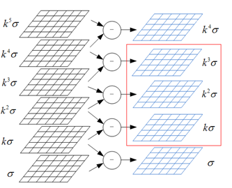

# 3.4 高斯金字塔

　　参考资料：[高斯金字塔](https://www.cnblogs.com/ronny/p/4028776.html)。我们首先定义以下概念。

* $I(x,y)$ 表示图像；
* $G(x,y,\sigma)$ 表示高斯滤波器，$G(x,y,\sigma) = \frac{1}{2 \pi \sigma^2}e^{-\frac{x^2 + y^2}{2 \sigma^2}}$
* $L(x,y,\sigma) = G(x,y,\sigma) \otimes I(x,y)$
* $D(x,y,\sigma) = [G(x,y,k\sigma) - G(x,y,\sigma)] \otimes I(x,y) = L(x,y,k\sigma) - L(x,y,\sigma)$  
  * **尺度为 $\sigma$ 的 DoG 图像由尺度为 $k \sigma$ 和 $\sigma$ 的 LoG 图像生成**。
  * $k$ 为两相邻尺度空间倍数的常数，也称为“阶跃因子”。
* $O$ ：高斯金字塔的组数（Octave）。其中值得注意的是在实际构建中，**第一组的索引可以为 0 也可以为 -1**，这个在后面解释原理。
* $S$ ：高斯金字塔每一组的层数。在实际**最开始构建尺度空间图像，即 LoG 图像的时候，构建了 S+3 层**，一定要把这个 S+3 与 S 区分开，为什么是 S+3 后面分析。
* 连续做 $\sigma_1,\ \sigma_2$ 的高斯卷积，相当于做一次 $\sigma_3 = \sqrt{\sigma_1^2 + \sigma_2^2}$

# 1. 第一组第一层图像的生成

　　这里要分两种情况：其一是把第一组的索引定为 0 ；其二是把第一组的索引定为 -1 。

　　我们先考虑第一组索引为 0 的情况，我们知道第一组第一层的图像是由原图像与 $\sigma_0$（一般设置为 1.6）的高斯滤波器卷积生成，那么原图像是谁呢？是 $I(x,y)$ 吗？不是！**为了图像反走样的需要，通常假设输入图像是经过高斯平滑处理的**，其值为 $\sigma_n = 0.5$ ，即半个像元。意思就是说我们采集到的图像 $I(x,y)$，已经被 $\sigma = \sigma_n = 0.5$ 的高斯滤波器平滑过了。

　　所以我们不能直接对 $I(x,y)$ 用 $\sigma_0$ 的高斯滤波器平滑，相当于设 $\sigma_3 = \sigma_0 = 1.6,\ \sigma_1 = \sigma_n = 0.5$ 求 $\sigma_2$ 的值，所以 $\sigma_2 = \sqrt{\sigma_3^2 - \sigma_1^2} = \sqrt{\sigma_0^2 - \sigma_n^2}$ ，因此我们需要使用 $\sigma_2$ 来对图像进行高斯平滑。

$$
FirstLayer(x,y) = I(x,y) \otimes G(x, y, \sqrt{\sigma_0^2 - \sigma_n^2})
$$

　　其中，$FisrtLayer(x,y)$ 表示整个尺度空间的第 1 组第 1 层的图像，一般 $\sigma_0 = 1.6,\ \sigma_n = 0.5$ 。

　　现在我们来考虑把第一组的索引定为 -1 的情况。那么首先第一个问题便是为什么要把索引定为 -1 。如果索引为 0 ，如上面那种情况所示，**整个尺度空间的第 1 组的第 1 层图像已经是由原图像模糊生成的了，那么也就是说已经丢失了细节信息，那么原图像我们完全没有利用上**。

　　基于这种考虑，我们先将图像放大 2 倍，这样原图像的细节就隐藏在了其中。由上面一种情况分析，我们已经知道了 $I(x,y)$ 看成是已经被 $\sigma_n = 0.5$ 模糊过的图像，那么将 $I(x,y)$ 放大 2 倍后得到 $Is(x,y)$ ，则可以看为是被 $2 \sigma_n = 1$ 的高斯核模糊过的图像。那么由 $Is$ 生成第 1 组第 1 层的图像用的高斯滤波器的 $\sigma = \sqrt{\sigma_0^2 - (2 \sigma_n)^2}$  。

$$
FirstLayer(x,y) = I_s(x,y) \otimes G(x, y, \sqrt{\sigma_0^2 - (2 \sigma_n)^2})
$$

　　其中，$FisrtLayer(x,y)$ 表示整个尺度空间的第 1 组第 1 层的图像，$I_s(x, y)$ 是由 $I(x,y)$ 用双线性插值放大后的图像。一般 $\sigma_0 = 1.6,\ \sigma_n = 0.5$ 。

* 索引为 0 时，第 0 层为 $I(x,y)$ ，这是经过 $\sigma_n = 0.5$ 的高斯模糊后的图像；然后施加 $\sqrt{\sigma_0^2 - \sigma_n^2}$ ，其结果便为第 1 层图像，相比较于原图做 1.6 的高斯模糊。
* 索引为 -1 时，第 -1 层为 $I(x,y)$ ，第 0 层是经过 $2 \sigma_n$ 后 2 倍放大后的图像，施加 $\sqrt{\sigma_0^2 - (2 \sigma_n)^2}$ 后便得到第 1 层图像，满足较于原图做 1.6 的高斯模糊。

# 2. 尺度空间生成了多少图像

　　我们知道 $S$ 是我们最终构建出来的用来寻找特征点的高斯差分图像，而特征点的寻找需要查找的是空间局部极小值，即**在某一层上查找局部极值点的时候需要用到上一层与下一层的高斯差分图像**，所以如果我们需要查找 S 层的特征点，需要 S+2 层高斯差分图像，然后查找其中的第 2 层到第 S+1 层。

　　假设 $S = 3$ ，则下图左侧为 $L(x,y,\sigma), L(x,y,k\sigma), L(x,y,k^2 \sigma), L(x,y,k^3\sigma), L(x,y,k^4\sigma), L(x,y,k^5\sigma)$ ，相邻层做减法后，可生成右侧的 DoG，即 $D(x,y,\sigma), D(x,y,k \sigma), D(x,y,k^2 \sigma), D(x,y,k^3 \sigma), D(x,y,k^4 \sigma)$ 。红框中的三张图片是我们用来查找局部极值点的的图像。

　　

　　从上面的分析,我们知道对于尺度空间来说，我们一共需要 `S+3` 层图像来构建出来 `S+2` 层高斯差分图像。所以，如果整个尺度空间一共有 `O` 组，每组有 `S+3` 层图像。共 `O*(S+3)` 张尺度图像（即 LoG）。

# 3. 为什么是倒数第 3 张

　　取上一张的倒数第 3 张图像隔行采样后作为下一组的第一张图像，这是**为了保证尺度空间的连续性**。

　　我们知道对于尺度空间第 $o$ 组，第 $s$ 层的图像，它的尺度为 $\sigma = \sigma_0 k^{o + s/S}$ ，其中 $k = 2,\ o \in [0, 1, \cdots , n(Octave) - 1],\ s \in [0, 1 \cdots S + 2]$ ，那我们令 $S=3$ ，从第 0 组开始看它各层的尺度，即 LoG。

$$
\begin{aligned}
第0组&\ \sigma_0 \rightarrow 2^{\frac{1}{3}}\sigma_0 \rightarrow 2^{\frac{2}{3}}\sigma_0 \rightarrow 2^{\frac{3}{3}}\sigma_0 \rightarrow 2^{\frac{4}{3}}\sigma_0 \rightarrow 2^{\frac{5}{3}}\sigma_0
\\
第1组&\ 2 \sigma_0 \rightarrow 2 * 2^{\frac{1}{3}}\sigma_0 \rightarrow 2 * 2^{\frac{2}{3}}\sigma_0 \rightarrow 2 * 2^{\frac{3}{3}}\sigma_0 \rightarrow 2 * 2^{\frac{4}{3}}\sigma_0 \rightarrow 2 * 2^{\frac{5}{3}}\sigma_0
\\
\cdots
\end{aligned}
$$

　　可以得出以下结论：

* 第 1 组的第 0 层图像恰好与第 0 组的倒数第三幅图像（第 3 层）一致，尺度都为 $2 \sigma_0$ ，所以我们**不需要再根据原图来重新卷积生成每组的第 0 层图像，只需采用上一层的倒数第 3 张（第 S 层）来降采样即可**；
* **通过降采样缩小图像的尺寸，变相的增加了 $\sigma$ 的大小**；
* 观察各组在各自的第 0 层上的计算，我们发现第 0 组和第 1 组的算子其实是一样的，都是从 $2^{\frac{1}{3}}$ 到 $2^{\frac{5}{3}}$ ，因此当 $S$ 确定后，每组的算子也就确定了。

　　我们继续分析其 DoG 情况：

$$
\begin{aligned}
第0组&\ \sigma_0 \rightarrow 2^{\frac{1}{3}}\sigma_0 \rightarrow 2^{\frac{2}{3}}\sigma_0 \rightarrow 2^{\frac{3}{3}}\sigma_0 \rightarrow 2^{\frac{4}{3}}\sigma_0
\\
第1组&\ 2 \sigma_0 \rightarrow 2 * 2^{\frac{1}{3}}\sigma_0 \rightarrow 2 * 2^{\frac{2}{3}}\sigma_0 \rightarrow 2 * 2^{\frac{3}{3}}\sigma_0 \rightarrow 2 * 2^{\frac{4}{3}}\sigma_0
\end{aligned}
$$

　　使用 DoG 进行局部极值点查找时，只能使用中间 3 层。我们把这两组的中间三层取出来，有：

$$
2^{\frac{1}{3}}\sigma_0 \rightarrow 2^{\frac{2}{3}}\sigma_0 \rightarrow 2^{\frac{3}{3}}\sigma_0 \rightarrow 2 * 2^{\frac{1}{3}}\sigma_0 \rightarrow 2 * 2^{\frac{2}{3}}\sigma_0 \rightarrow 2 * 2^{\frac{3}{3}}\sigma_0
$$

　　我们发现**正好连续**！！这一效果带来的直接的好处是在尺度空间的极值点确定过程中，我们不会漏掉任何一个尺度上的极值点，而是能够综合考虑量化的尺度因子。

# 4. 用第 $i-1$ 层的图像生成第 $i$ 层图像

　　值得注意的是，在 SITF 的源码里，尺度空间里的每一层的图像（除了第 1 层）都是由其前面一层的图像和一个相对 $sigma$ 的高斯滤波器卷积生成，而不是由原图和对应尺度的高斯滤波器生成的。

　　主要原因是因为前面提到的不存在所谓意思上的“原图”，我们的输入图像 $I(x,y)$ 已经是尺度为 $\sigma = 0.5$ 的图像了。次要原因是由于如果用原图计算，那么相邻两层之间相差的尺度实际上非常小，这样会造成在做高斯差分图像的时候，大部分值都趋近于 0，以致于后面我们很难检测到特征点。所以对**于每一组的第 $i+1$ 层的图像，都是由第 $i$ 层的图像和一个相对尺度的高斯滤波器卷积生成**。

　　关于相对尺度的计算。比如第 0 组的第 $i+1$ 层和第 $i$ 层，它们的相对尺度为：

$$
\begin{align}
SigmaDiff_1 = \sqrt{(\sigma_0 k^{i+1})^2 - (\sigma_0 k^{i})^2}
\end{align}
$$

　　为了保持尺度的连续性，后面的每一组都用这样一样相对尺度（SIFT 实际代码里是这样做的）。但是在第 1 组中第 $i+1$ 层和第 $i$ 层的相对尺度：

$$
\begin{align}
\sqrt{(2\sigma_0 k^{i+1})^2 - (2\sigma_0 k^{i})^2} = 2 \times SigmaDiff_1
\end{align}
$$

　　猜测是和降采样有关。

```cpp
sig[0] = sigma;
double k = pow(2., 1. / nOctaveLayers);
for (int i = 1; i < nOctaveLayers + 3; i++)
{
    double sig_prev = pow(k, (double)(i - 1))*sigma;
    double sig_total = sig_prev*k;
    sig[i] = std::sqrt(sig_total*sig_total - sig_prev*sig_prev);
}
```

　　
