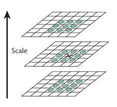

# 3.5 特征点搜索

# 1. 搜索策略

　　斑点的搜索是通过同一组内各 DoG 相邻层之间比较完成的。为了寻找尺度空间的极值点，每一个采样点要和它所有的相邻点进行比较，看其是否比它的图像域和尺度域的相邻点大或小。对于其中的任意一个检测点都要和它同尺度的 8 个相邻点和上下相邻尺度对应的 $9×2$ 个点共 26 个点比较，以确保在尺度空间和二维图像位置空间都检测到极值点。也就是，比较是在一个 $3×3$ 的立方体内进行。

　　

　　搜索过程从每组的第二层开始，以第二层为当前层，对第二层的 DoG 图像中的每个点取一个 $3×3$ 的立方体，立方体上下层为第一层与第三层。这样，搜索得到的极值点既有位置坐标（ DoG 的图像坐标），又有空间尺度坐标（层坐标）。当第二层搜索完成后，再以第三层作为当前层，其过程与第二层的搜索类似。当 $S=3$ 时，每组里面要搜索 3 层。

# 2. 子像元差值

　　以上的的极值点的搜索是在离散空间中进行的，检测到的极值点并不是真正意义上的极值点。下图显示了一维信号离散空间得到的极值点与连续空间的极值点之间的差别。**利用已知的离散空间点插值到连续空间极值点的方法叫子像元插值**。

　　我们一维函数插值来介绍子像元插值。我们已知：$f(-1) = 1,\ f(0) = 6,\ f(1) = 5$ ，求 $f(x)$ 在 $[-1, 1]$ 上的最大值。

　　首先我们先引入有限差分法求导。

$$
对f(x),\ x \in [a,b];\ 步长 h = \Delta x 将 [a,b] 等分，自然是 h 越小逼近效果越好。
\\
x_1 = a,x_2 = a + h, \cdots, x_{n+1} = x_n + h = b
\\
\mathrm{def} \left\{ \begin{matrix}
f(x_i + h) - f(x_i) 为x_i的前向差分；
\\
f(x_i) - f(x_i-h)为后向差分；
\\
f(x_i + h) - f(x_i - h)为中心差分
\end{matrix}
\right.
\\
\because f(x) = f(x_i) + f'(x_i)(x - x_i) +\frac{f''(x_i)}{2}(x - x_i)^2 + \cdots
\\
\therefore f(x_i - h) = f(x_i) + f'(x_i)((x_i - h) - x_i) +\frac{f''(x_i)}{2}((x_i - h) - x_i)^2 + \cdots
\\
f(x_i + h) = f(x_i) + f'(x_i)((x_i + h) - x_i) +\frac{f''(x_i)}{2}((x_i + h) - x_i)^2 + \cdots
\\
\therefore 对一元函数有：f'(x_i) \approx \frac{f(x_i + h) - f(x_i + h)}{2h}(忽略第2项之后的所有项)
\\
f''(x_i) \approx \frac{f(x_i + h) + f(x_i + h) - 2f(x_i)}{h^2}
\\
\\
\because 对于二元函数有：f(x+\Delta x, y+\Delta y)=f(x, y)+\Delta x \frac{\partial f(x, y)}{\partial x}+\Delta y \frac{\partial f(x, y)}{\partial y} 
\\
+\frac{1}{2 !}\left[(\Delta x)^{2} \frac{\partial^{2} f(x, y)}{\partial x^{2}}+2 \Delta x \Delta y \frac{\partial^{2} f(x, y)}{\partial x \partial y}+(\Delta y)^{2} \frac{\partial^{2} f(x, y)}{\partial y^{2}}\right] 
\\
+\frac{1}{3 !}\left[(\Delta x)^{3} \frac{\partial^{3} f(x, y)}{\partial x^{3}}+3(\Delta x)^{2} \Delta y \frac{\partial^{3} f(x, y)}{\partial x^{2} \partial y}+3 \Delta x(\Delta y)^{2} \frac{\partial^{3} f(x, y)}{\partial x \partial y^{2}}+(\Delta y)^{3} \frac{\partial^{3} f(x, y)}{\partial y^{3}}\right]+\ldots
\\
用同样的方法写出 f\left(x_{i}+h, y_{i}+h\right), f\left(x_{i}+h, y_{i}+h\right), f\left(x_{i}+h, y_{i}+h\right) \text { 和 } f\left(x_{i}+h, y_{i}+h\right) 的展开项
\\
\therefore \begin{aligned}
\frac{\partial^{2} f\left(x_{i}, y_{i}\right)}{\partial x \partial y} \approx 
& \frac{1}{4 h^{2}}\left[f\left(x_{i}+h, y_{i}+h\right)+f\left(x_{i}-h, y_{i}-h\right)\right.
\\
&\left.-f\left(x_{i}+h, y_{i}-h\right)-f\left(x_{i}-h, y_{i}+h\right)\right]
\end{aligned}
$$

　　在图像处理中，上式中 $h$ 一般为 1 。

$$
\because f(x) \approx f(0) + f^{'}(0) x + \frac{f^{''}(0)}{2} x^2 
\\
f(x)在x处的导数写成离散形式，f’(x) = \frac{f(x+1) – f(x)}{2},\ f’’(x) = f(x+1)+f(x-1)-2f(x)
\\
\therefore f(x) \approx 6+2x+\frac{-6}{2}x^2 = 6+2x-3x^2
\\
\therefore f’(x) = 2-6x = 0,\ \hat{x} = \frac{1}{3} 为极大值所在处
\\
\therefore 极大值为\ f(\hat{x}) = 6+2\times \frac{1}{3} – 3\times(\frac{1}{3})^2 = 6\frac{1}{3}
$$

　　现在回到我们 SIFT 点检测中来，我们要考虑的是一个三维问题，假设我们在尺度为 $\sigma$ 的尺度图像 $D(x,y)$ 上检测到了一个局部极值点，空间位置为 $(x,y,\sigma)$ ，由上面的分析我们知道，它只是一个离散情况下的极值点，连续情况下，极值点可能落在了 $(x,y,\sigma)$ 的附近，设其偏离了 $(x,y,\sigma)$ 的坐标为 $(\Delta x,\Delta y,\Delta \sigma)$ 。则对 $D(\Delta x,\Delta y,\Delta \sigma)$ 可以表示为在点 $(x,y,\sigma)$ 处的泰勒展开：

$$
D(\Delta x,\Delta y,\Delta \sigma) = D(x,y,\sigma) + \begin{bmatrix}  
\frac{\partial D}{x} & \frac{\partial D}{y} & \frac{\partial D}{\sigma} 
\end{bmatrix} \begin{bmatrix} 
\Delta x\\ 
\Delta y\\ 
\Delta \sigma 
\end{bmatrix}
\\
+ \frac{1}{2}\begin{bmatrix} 
\Delta x &\Delta y  & \Delta \sigma 
\end{bmatrix} \begin{bmatrix} 
\frac{\partial ^2D}{\partial x^2} & \frac{\partial ^2D}{\partial x\partial y} &\frac{\partial ^2D}{\partial x\partial \sigma} \\ 
\frac{\partial ^2D}{\partial y\partial x}& \frac{\partial ^2D}{\partial y^2} & \frac{\partial ^2D}{\partial y\partial \sigma}\\ 
\frac{\partial ^2D}{\partial \sigma\partial x}&\frac{\partial ^2D}{\partial \sigma\partial y}  & \frac{\partial ^2D}{\partial \sigma^2} 
\end{bmatrix} \begin{bmatrix} 
\Delta x\\ 
\Delta y\\ 
\Delta \sigma 
\end{bmatrix}
\\
写成矢量形式有：D(x) = D+\frac{\partial D^T}{\partial x}\Delta x+\frac{1}{2}\Delta x^T\frac{\partial ^2D^T}{\partial x^2}\Delta x 
\\
令D'(x) = 0,\ 有\Delta x = -\frac{\partial^2D^{-1}}{\partial x^2}\frac{\partial D(x)}{\partial x}
$$

　　通过多次迭代（Lowe 算法里最多迭代 5 次），得到最终候选点的精确位置与尺度 $\hat{x} = (x,y,z,\sigma)$ ，将其代入公式求得 $D(\hat{x})$ ，求其绝对值得  $|D(\hat{x})|$ 。如果其绝对值低于阈值的将被删除。

```cpp
Vec3f dD((img.at<sift_wt>(r, c + 1) - img.at<sift_wt>(r, c - 1))*deriv_scale,
    (img.at<sift_wt>(r + 1, c) - img.at<sift_wt>(r - 1, c))*deriv_scale,
    (next.at<sift_wt>(r, c) - prev.at<sift_wt>(r, c))*deriv_scale);
// dD为一阶差分矢量Df/Dx
float v2 = (float)img.at<sift_wt>(r, c) * 2;
float dxx = (img.at<sift_wt>(r, c + 1) + img.at<sift_wt>(r, c - 1) - v2)*second_deriv_scale;
float dyy = (img.at<sift_wt>(r + 1, c) + img.at<sift_wt>(r - 1, c) - v2)*second_deriv_scale;
float dss = (next.at<sift_wt>(r, c) + prev.at<sift_wt>(r, c) - v2)*second_deriv_scale;
float dxy = (img.at<sift_wt>(r + 1, c + 1) - img.at<sift_wt>(r + 1, c - 1) -
    img.at<sift_wt>(r - 1, c + 1) + img.at<sift_wt>(r - 1, c - 1))*cross_deriv_scale;
float dxs = (next.at<sift_wt>(r, c + 1) - next.at<sift_wt>(r, c - 1) -
    prev.at<sift_wt>(r, c + 1) + prev.at<sift_wt>(r, c - 1))*cross_deriv_scale;
float dys = (next.at<sift_wt>(r + 1, c) - next.at<sift_wt>(r - 1, c) -
    prev.at<sift_wt>(r + 1, c) + prev.at<sift_wt>(r - 1, c))*cross_deriv_scale;

Matx33f H(dxx, dxy, dxs,
    dxy, dyy, dys,
    dxs, dys, dss);
// dD + Hx = 0  -->  x = H^-1 * (-dD)
Vec3f X = H.solve(dD, DECOMP_LU);
```

# 3. 删除边缘效应

　　为了得到稳定的特征点，只是删除 DoG 响应值低的点是不够的。**由于 DoG 对图像中的边缘有比较强的响应值，而一旦特征点落在图像的边缘上，这些点就是不稳定的点**。一方面图像边缘上的点是很难定位的，具有定位歧义性；另一方面这样的点很容易受到噪声的干扰而变得不稳定。

　　一个平坦的 DoG 响应峰值往往在横跨边缘的地方有较大的主曲率，而在垂直边缘的方向有较小的主曲率。而主曲率可以通过 Hessian 矩阵 $H$ 求出：

$$
H(x,y) = \begin{bmatrix}
D_{xx}(x,y) & D_{xy}(x,y) \\ 
D_{xy}(x,y) &D_{yy}(x,y) 
\end{bmatrix}
$$

　　上式中，$D$ 值可以通过求取邻近点像素的差分得到。$H$ 的特征值与 $D$ 的主曲率成正比例。我们可以避免求取具体的特征值，因为我们只关心特征值的比例。令 $\alpha = \lambda_{max}$ 为最大的特征值，$\beta = \lambda_{min}$ 为最小的特征值，我们通过特征值的性质有下式成立：

$$
\begin{cases}
Tr(H) = D_{xx}+D_{yy} = \alpha +\beta
\\
Det(H) = D_{xx}D_{yy}-(D_{xy})^2=\alpha \beta
\end{cases}
$$

　　令 $\alpha = \gamma \cdot \beta$ ，$\gamma$ 为比例系数，则有：$\frac{Tr(H)^2}{Det(H)} = \frac{(\alpha + \beta)^2}{\alpha \beta} = \frac{(\gamma + 1)^2}{\gamma}$ 。当两个特征值相等时，$\gamma = 1$ ，上式有最小值；随着 $\gamma$  值的增加，上式的值也逐渐增加。

　　所以，想要检查主曲率的比例小于某一阈值 $\gamma$ ，只要检查 $\frac{Tr(H)^2}{Det(H)} < \frac{(\gamma+1)^2}{\gamma}$ 是否成立。Lowe 在论文中给出的 $\gamma = 10$ 。也就是说对于主曲率比值大于 10 的特征点将被删除。

# 4. 关键点方向分配

　　为了使描述符具有旋转不变性，需要利用图像的局部特征为给每一个关键点分配一个基准方向。使用图像梯度的方法求取局部结构的稳定方向。对于在 DOG 金字塔中检测出的关键点点，**采集其所在高斯金字塔图像 $3 \sigma$ 邻域窗口内像素的梯度和方向分布特征**。梯度的模值和方向如下：

$$
\begin{cases}
m(x, y)=\sqrt{(L(x+1, y)-L(x-1, y))^{2}+(L(x, y+1)-L(x, y-1))^{2}} \\
\left.\theta(x, y)=\tan ^{-1}((L(x, y+1)-L(x, y-1)) / L(x+1, y)-L(x-1, y))\right)
\end{cases}
$$

　　有关详细内容见：[关键点方向分配](https://blog.csdn.net/zddblog/article/details/7521424)

　　
