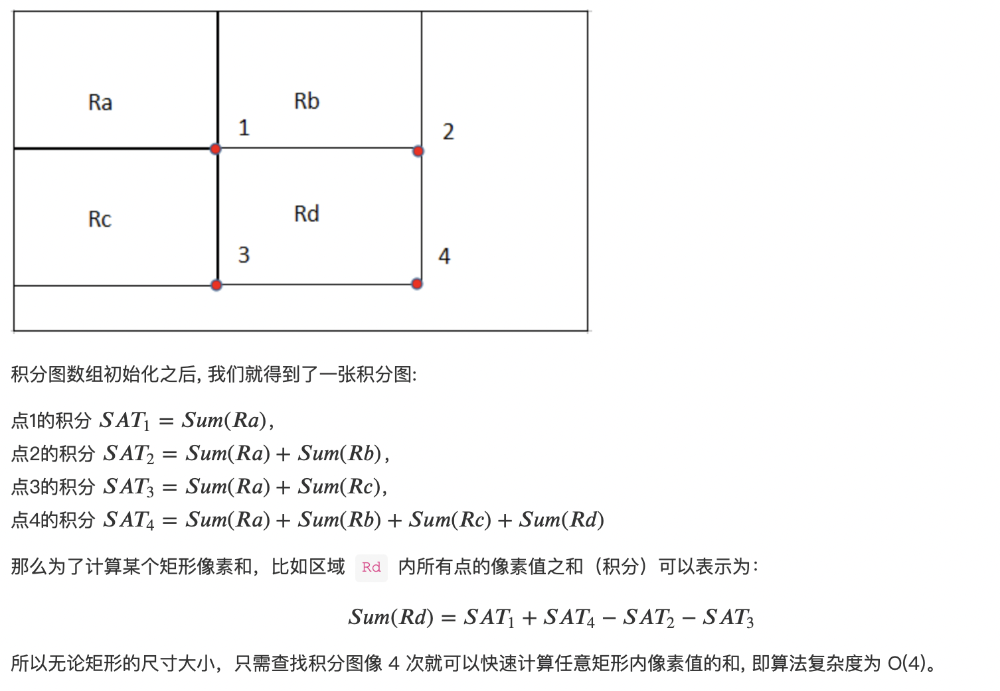

# 3.6 改进：Surf 算法

　　SIFT 算法比较耗时的地方有两点：对图像做高斯卷积，对特征点进行匹配。surf 算法便是针对高斯卷积做了两点改进。

　　首先是使用均值卷积核替代了高斯卷积核。使用均值滤波的话就将乘法变成了加法。但是上面我们说过高斯卷积核是最接近生物视觉特性的卷积核，均值卷积核在效果上肯定是不如高斯卷积核的。也就是用效果换

　　其次是引入了积分图法。如果加法的数量多的话，加法的工作量也很大。所以 surf 算法会先扫描图像，对图像重新赋值。有关积分图法的详细内容可见这个[参考链接](https://www.cnblogs.com/magic-428/p/9149868.html)。

　　

　　对于 SIFT 中点的匹配，比如 100 个点和 200 个点做匹配，暴力匹配要做 100*200 次。可以改进的思路有：

* 把区域进行网格化。我们认为点应该分散分布，如果集中分布某处是不好的；
* 如果每一层的点的数量很多，可以尝试减少层数。但是这么做是有风险的。
