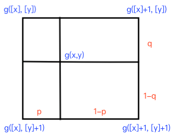

# 4.2 图像的几何变换

　　变换分为仿射变换和透视变换。仿射变换包括：平移，旋转，缩放和翻转。

　　**仿射变换和透视变换都是线性变换。但是仿射变换会保持平行性和平直性，透视变换不会保持这两个性质**。所以仿射变换可以作为一种特殊的透视变换。

# 1. 齐次坐标

　　线性变换可以由矩阵乘法来刻画。比如旋转就可以写成 $X' = R X$ 。但是如果是平移，$X' = X + T$ ，我们不希望引入加号，也想用乘法来表征。所以便引入了齐次坐标。齐次坐标可以看作是三维空间中，二维点投影在 $H=1$ 平面上。

$$
\begin{align}
\begin{bmatrix} 
x \\ y 
\end{bmatrix} = \begin{bmatrix} 
1 & 0 & \Delta x \\ 
0 & 1 & \Delta y 
\end{bmatrix} \cdot \begin{bmatrix} 
x_0 \\ y_0 \\ 1
\end{bmatrix} = \begin{bmatrix} 
x_0 + \Delta x \\ 
y_0 + \Delta y
\end{bmatrix}
\end{align}
$$

　　中间的 $2 \times 3$ 矩阵就是加入平移向量的变换矩阵。我们一般会再加一行：

$$
\begin{align}
\begin{bmatrix} 
x \\ 
y \\
1
\end{bmatrix} = \begin{bmatrix} 
1 & 0 & \Delta x \\ 
0 & 1 & \Delta y \\
0 & 0 & 1
\end{bmatrix} \cdot \begin{bmatrix} 
x_0 \\ 
y_0 \\
1
\end{bmatrix} = \begin{bmatrix} 
x_0 + \Delta x \\ 
y_0 + \Delta y \\
1
\end{bmatrix}
\end{align}
$$

　　这样就是一个从齐次坐标到齐次坐标的映射，更简洁美观。平移变换矩阵如上所示。

# 2. 比例缩放和双线性插值

　　对图像进行放缩时，缩小可以看成是降采样，降低尺寸即可；但如果是放大呢？比如尺寸为 $100 \times 100$ 的图像 1 需要放大到 $200 \times 200$ ，该如何做呢？放大过程是实则是给大尺寸图像填充像素值的过程，来源就是原始图像，即 $I_1 \rightarrow I_2$ ，那么反过来说 $I_2 \rightarrow I_1$ ，而 $I_1$ 中各点的像素值是已知的，我们可以依照一定规则，$I_2$ 中 $(x,y)$ 处的像素值就是映射到 $I_1$ 中 $(x', y')$ 处的像素值。

　　但是总有可能出现这种情况：$(3,2) \rightarrow (1.4, 0.5)$ 即位置坐标非整数值，那么我们该如何取值呢？这时候就用到了双线性插值。

　　什么是线性插值？比如对于坐标 $0 \rightarrow 100$ ，值的变化为 $50 \rightarrow 100$ ，那么坐标为 60 处其值按照均匀变化应该为多少呢？$(100-50)/100*60 = 30$ 。双线性插值就是在两个方向上这么做。见下图：

　　

　　对于映射到 $I_1$ 的位置 $(x,y)$ ，先对其取整，找出离其最近的四个像素点。

$$
\begin{align}
g(x,y) = (1-q)\{\ (1-p) \cdot g([x], [y]) + p \cdot g([x]+1, [y]) \} \\
+ q\{\ (1-p) \cdot g([x], [y]+1) + p \cdot g([x]+1, [y]+1) \}
\end{align}
$$

　　我们先观察第一个花括号中的内容，可以改写成：$g([x], [y]) + p(g([x]+1, [y]) - g([x], [y]))$ 。这便是水平方向上的线性插值，同理，第二个花括号中的值也是沿下面那条水平线的线性插值。在竖直方向上，用同样的道理。水平和竖直方向相加便是 $g(x,y)$ 的值。

# 3. 旋转变换

　　

　　

　　理解旋转有两种方式：三角关系和基向量。从第一张示意图就能从三角关系的角度进行推导。从基向量角度，我们把 $(x,y)$ 和 $(x_0, y_0)$ 视为两个坐标系，其中第一个的基向量为 $(1, 0, 0)$ 这类的单位向量，那么旋转矩阵就是两个坐标系基向量之间的变换关系。所以把第二个坐标系的基向量以第一个坐标系的基向量表示出来，就得到了旋转矩阵。

　　为了方便使用，可以记住：逆时针旋转第一列有符号，顺时针旋转第二列有符号。

# 3. 仿射变换和透视变换

　　透视变换(Perspective Transformation)是将图片投影到一个新的视平面(Viewing Plane)，也称作投影映射(Projective Mapping)。

　　

　　之前所有仿射变换的变换矩阵最后一行都是 $[0,0,1]$，所以总共有 6 个变量，但是透视变换不是一共有 8 个变量。

　　一般来说，如果相机和目标物间距较远，则可以用仿射变换矩阵来描述，如下所示：

$$
\begin{bmatrix} 
x & x & x \\
x & x & x \\
0 & 0 & 1
\end{bmatrix}
$$

　　如果距离不够远，则为透视变换，变换矩阵为：

$$
\begin{bmatrix} 
x & x & x \\
x & x & x \\
x & x & 1
\end{bmatrix}
$$

　　我们在做估计时，也就是要确定这些参数的值。所以会看到，一般会在两张图像上各点 4 个点，也就是 8 个点代表 8 个方程，来解上面 8 个参数。

　　在解方程前，我们先引入最小二乘法，然后介绍相机模型列出具体方程。

# 4. 最小二乘法

　　对于上面的所有情况可以写成：$Y = T \cdot X$ 。我们往往已知 $X,\ Y$ 来求解变换矩阵 $T$ 。比如对于方程组：

$$
\begin{align}
\begin{cases}
2x_1 + x_2 = 4 \\
3x_1 + 5x_2 = 2
\end{cases} \\
\begin{bmatrix} 2 \\ 3 \end{bmatrix} x_1 + \begin{bmatrix} 1 \\ 5 \end{bmatrix} x_2 = \begin{bmatrix} 4 \\ 2 \end{bmatrix} \\
\rightarrow a_1 x_1 + a_2 x_2 = b
\end{align}
$$

　　方程的几何意义为通过向量 $a_1,\ a_2$ 的线性组合能否构造出向量 $b$ ，不能构造只有一种情况：$b$ 和 $a_1,a_2$ 不在一个平面上，此时方程组无解。

　　从线性代数中解方程的知识可知，方程分为欠定、适定和超定。比如求经过 3 个点的直线，但是直线方程只需要两个点，这便是超定。

　　在实际工程中，情况往往是超定方程组，比如用 8 个方程确定 4 个未知数。此时尽管无解，但是我们仍希望寻找一个离向量 $b$ 最近的，也就是误差 $e$ 最小的向量来近似替代。根据投影的知识，我们知道误差最小的向量就是 $b$ 在由 $a_1,a_2$ 构成平面的投影。所以，**最小二乘法就是高维空间的向量在低维子空间的投影**。

　　在编程实现时，我们一般使用下面这种方式：

$$
\begin{align}
A \lambda &= B \\
A^T A \lambda &= A^T B \\
\lambda &= (A^T A)^{-1} A^T B
\end{align}
$$

　　通过上面的操作，我们就把未知数 $\lambda$ 求出来了。但是如果 $(A^T A)^{-1}$ 不存在呢？程序的处理方法为：在 $A$ 的基础上增加一个正则项，使 $A$ 可逆，接着进行求解。

　　野值点对于最小二乘法的影响很大。因为最小二乘用上了所有点的信息，所以野值点对其影响很大。

　　那如果 $f(x)$ 是非线性的呢？用泰勒展开将它变成线性的情况求解。

　　
