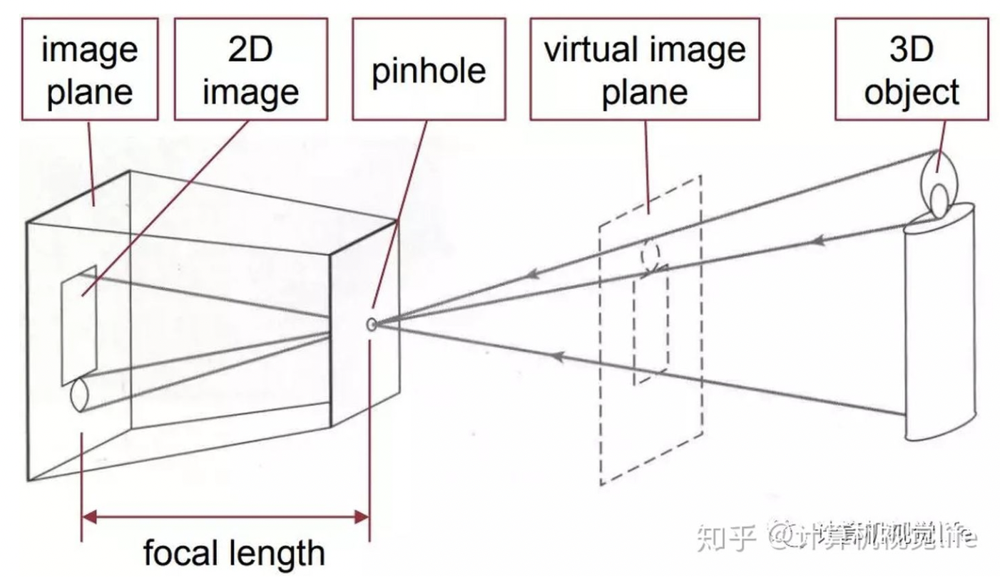
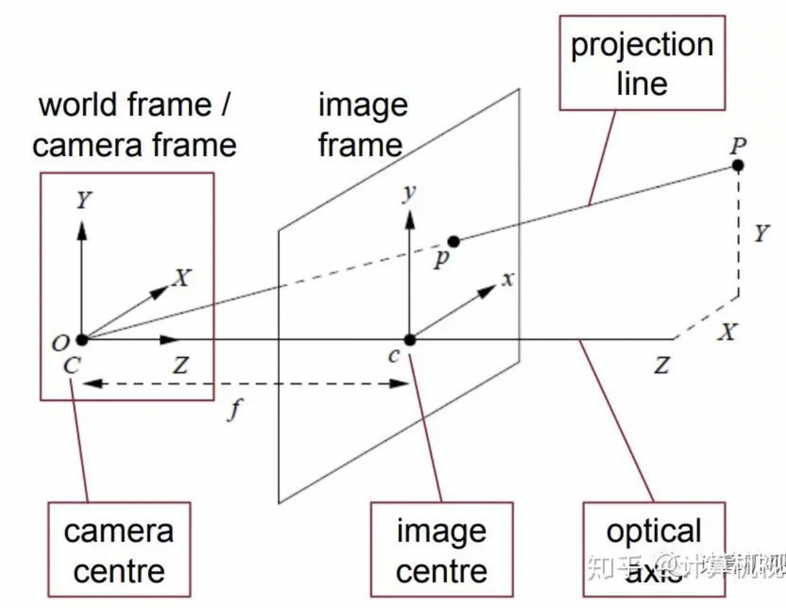
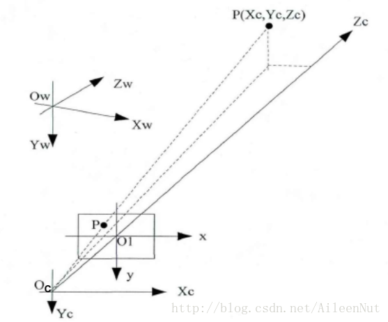
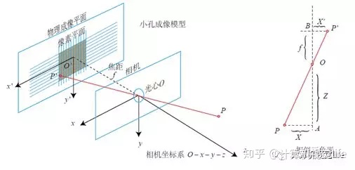
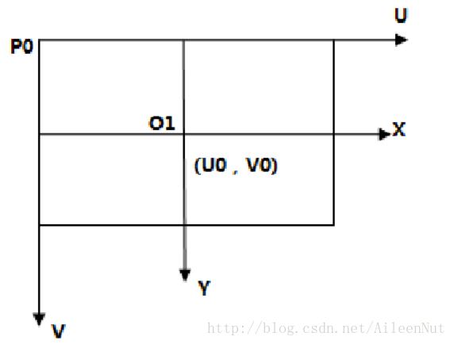
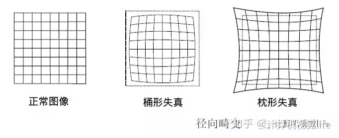
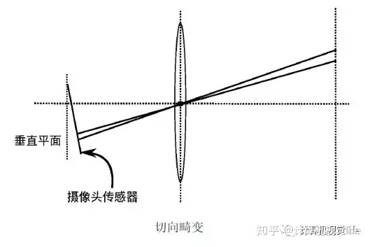
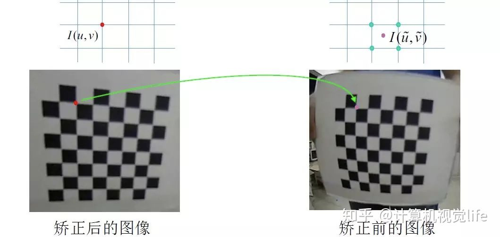

# 4.3 相机成像模型

# 1. 相机小孔成像模型

　　本文[参考链接点这里](https://zhuanlan.zhihu.com/p/47994715)。

　　

　　把这个模型对应到相机上：**光心**就是小孔处，最左侧的成像面 `image plane` 就是相机的成像靶面。

　　我们为了方便推导，一般用右侧的虚像 `virtual image plane` 来代替左侧的成像面，两者是对称关系，即光心距虚像面的距离也是焦距 `​f`。

　　上面这个是从小孔成像的精确推导上理解：为什么下面的推导中把成像面放到了前面。那么下图中的 $O_c$ 就是光心，也就是透镜的中心，`image frame` 就是虚像面。也可以从透视变换的角度大致理解一下：由于焦距相比物距差太多了，所以我们可以直接把像近似成在透镜上，所以 $O_c$ 就是成像靶面的中心，`image frame` 就是透镜。**这两种理解方式个人更倾向于第一种，所以下面我们也是从第一种的角度去考虑的**。

　　

　　**相机坐标系**是以相机的光心为原点 $O_c$，光轴为 $Z_c$ ，单位一般和**世界坐标系**一样，比如为米；虚像面（靶面）为**图像坐标系**，它是二维坐标系，单位一般为毫米。如果知道图像坐标系中 1 毫米代表多少像素，就能转换成我们平时接触到的图像，也就是**像素坐标系**，单位是像素，原点一般是在左上角，具体的下面会讲到。

　　世界坐标系、相机坐标系、图像坐标系之间的示意图。

　　

　　我们先理一下整体过程：

* 首先从世界坐标系 `(Xw, Yw, Zw)` 经过 `RT` 变换到相机坐标系 `(Xc, Yc, Zc)`。
* 相机坐标系是以相机的光心作为原点，光轴为坐标系的 $Z_c$ 轴，根据**简化的小孔成像模型**，物体所成的虚像就在图像坐标系中，也就是 $X_cO_cY_c$ 所在平面，这样就完成了从相机坐标系到图像坐标系的转换。
* 通过一毫米代表多少像素，就能把图像物理坐标系（毫米）转到图像坐标系（像素）。

　　上面这个示意图 $O_1$ 的位置是虚像的位置， $X_cY_c$ 平面是相机的靶面（实像），但是两者是对称的，所以在数学推导上等价。那如果我非要用实像来推导公式，可以吗？可以，比如下面这张示意图：

　　

　　光心 $O$ 所在的坐标系就是相机坐标系，$O'$ 就是图像坐标系，所以你把它放在 $O$ 前面或者后面没什么影响。下面我们从小到大逐步推导。

# 2. 图像坐标系 -> 像素坐标系

　　

　　图中 $O_1$ 是图像坐标系的原点，单位是毫米；而我们一般使用的 opencv 等像素坐标系原点一般在左上角 $P_0$ ，单位是像素。像素坐标系也称为 `uv` 系。

　　从图像坐标系转换到像素坐标系：

$$
\begin{align}
\begin{cases}
u = \frac{x}{dx} + u_0 \\
v = \frac{y}{dy} + v_0 \\
\end{cases}
\end{align}
$$

　　`dx` 和 `dy` 为横轴 x 和纵轴 y 单位尺寸所占的像素点数，单位为 `mm/pixel` 。 $u_0, v_0$ 是图像尺寸的一半。将其写成矩阵的形式：

$$
\begin{align}
\left[\begin{array}{c}
\mathrm{u} \\
\mathrm{v} \\
1
\end{array}\right]=\left[\begin{array}{ccc}
\frac{1}{d_x}, & 0 & \mathrm{u}_{0} \\
0 & \frac{1}{d_y} & \mathrm{v}_{0} \\
0 & 0 & 1
\end{array}\right]\left[\begin{array}{c}
\mathrm{x} \\
y \\
1
\end{array}\right]
\end{align}
$$

# 3. 相机坐标系 -> 图像坐标系

　　根据一开始的小孔成像模型，我们知道使用实像和虚像推导是等价的。为了和第 3 张各坐标系示意图相符合，我们这里用虚像来计算。这是一个三维到二维的转换。

　　 $O_cO_1 = f$ 代表焦距。由示意图中虚线部分所示的相似三角形关系，可得**图像物理坐标系和相机坐标系的转换关系**：

$$
\begin{align}
\begin{cases}
x = f \frac{x_{c}}{z_{c}} \\
y = f \frac{y_{c}}{z_{c}}
\end{cases}
\end{align}
$$

　　我们常用的是像素坐标系，所以需要再转换一步。这便引入了相机的内参。把方程（1）代入上式，可得出：

$$
\begin{align}
\begin{cases}
u = \frac{f x_c}{z_c dx} + u_0 = f_x \frac{x_c}{z_c} + u_0\\
v = \frac{f y_c}{z_c dy} + v_0 = f_y \frac{y_c}{z_c} + v_0 \\
\end{cases}
\end{align}
$$

　　其中，$f_x = \frac{f}{dx},\ f_y = \frac{f}{dy}$ ，单位是 `pixel` 。写成矩阵的形式：

$$
\begin{align}
z_{c} \left[ \begin{array}{c}
u \\
v \\
1
\end{array}\right]=\left[ \begin{array}{ccc}
f_{x} & 0 & u_{0} \\
0 & f_{y} & v_{0} \\
0 & 0 & 1
\end{array}\right] \left[ \begin{array}{l}
x_{c} \\
y_{c} \\
z_{c} \\
\end{array}\right] = K P_{c}
\end{align}
$$

　　所以，$z_c P_x = K P_c$ ，$K$ 表示相机的**内参(Camera Intrinsics)**矩阵。如果把 $z_c$ 除到到右边的相机坐标下，那么相机坐标就变成了 $(x_c/z_c, y_c/z_c, 1)$ 也就是归一化坐标，位于 $z_c=1$ 平面上。

# 3. 世界坐标系 -> 图像相机坐标系

$$
\begin{align}
P_c = \left[\begin{array}{c}
x_{c} \\
y_{c} \\
z_{c}
\end{array}\right]=\left[\begin{array}{cc}
R & T \end{array}\right]\left[\begin{array}{c}
x_w \\
y_w \\
z_w \\
1
\end{array}\right]=R P_w + T
\end{align}
$$

* `R` 为 3x3 的旋转矩阵，是三个轴向上的旋转矩阵的乘积，$R=R_x \cdot R_y \cdot R_z$。
* `T` 为 3x1 的平移向量，表示三个轴向上的平移距离，即 $T=[T_x, T_y, T_z]^T$ 。
* `RT` 合起来的构成的 4x4 矩阵称为相机的**外参矩阵(Camera Extrinsics)**

　　把内参和外参结合起来，就得到了从世界坐标系到像素坐标系完整的变换过程：

$$
\begin{align}
z_{c}\left[\begin{array}{l}
u \\
v \\
1
\end{array}\right]=K \cdot\left[\begin{array}{cc}
R & T
\end{array}\right]\left[\begin{array}{c}
x_{w} \\
y_{w} \\
z_{w} \\
1
\end{array}\right]
\end{align}
$$

　　左侧的 $z_c$ 是一个缩放因子，我们可以用 $s$ 来代替，所以上式便称为 $sRT$。

# 4. 位姿

　　相机外参将世界坐标系转换到相机坐标系，可以理解为：**世界坐标系下，相机坐标系的位姿**。

　　**位姿估计**：我们要获得物体的 3D 位姿，其实是建立在物体上的世界坐标系在相机坐标系下的位姿，也就是相机外参矩阵的逆（这是个相反的过程）。

　　对于位姿估计算法：

- 单目的 PNP 算法，也就是利用相机标定的原理计算出相机的内参矩阵和外参矩阵，进而可以做位姿估计；
- 双目和 RGB-D 的方法则是通过传感器计算 `Zc`，由于我们将世界坐标系人为建立在物体的特定位置，如果已知物体的 CAD 模型，那么就已知 `[Xw,Yw,Zw,1]'`,根据红色方程求解相机外参即可完成位姿估计。

# 5. 相机畸变

　　相机畸变的产生原因：

> 相机前面有个透镜，如果想要相机一次性拍摄很大的范围，像下面这个图这样，就需要把透镜做的中间很厚两边薄，这样光线经过透镜后会发生折射，相机就能看到更多物体啦。不过这样的话，我们前面的针孔模型中的那些三角形相似的假设就不能满足啦！
>
> 也就是说：畸变产生的原因是：透镜不能完全满足针孔模型假设
>

　　

　　相机透镜的畸变主要分为**径向畸变**和**切向畸变**，还有其他的畸变，但都没有径向和切向畸变影响显著，所以我们在这里只考虑**径向和切向畸变**。

　　径向畸变分为：桶形和枕形。它们共同的特点是：畸变程度都是从中心开始，用一个半径画圆的话，半径越大，圆周上的畸变程度也越大。这个就是由于相机透镜的形状导致的，且越向透镜边缘移动径向畸变越严重。

　　

　　切向畸变是由于透镜和 CMOS 或者 CCD 的安装位置误差导致。看下面的图，因此，如果存在切向畸变，一个矩形被投影到成像平面上时，很可能会变成一个梯形。不过随着相机制造工艺的大大提升，这种情况很少出现了，我们一般也不考虑切向的畸变。

　　

　　所以，接下来我们探讨如何去除径向畸变。首先需要**对相机进行标定**，标定完就能得到相机的所有内参，包括**畸变系数**。我们**用标定的畸变系数就能对畸变的图像进行去畸变**。所以假设我们已经标定好了并得到了畸变系数，去畸变公式为：

$$
\begin{align}
\begin{array}{l}
x_{\text {distorted }} = x\left(1+k_{1} r^{2}+k_{2} r^{4}+k_{3} r^{6}\right) \\
y_{\text {distorted }} = y\left(1+k_{1} r^{2}+k_{2} r^{4}+k_{3} r^{6}\right) \\
r^{2} = x^{2}+y^{2}
\end{array}
\end{align}
$$

　　$x,y_{\text {distorted }}$ 是原图中的坐标（没有去畸变的坐标），$x,y$ 是去畸变后的坐标，也可写为 $x_{\text {undistorted }}$。从方程的角度来看，左侧是已知量，右侧是未知量，而且还是高次的，求解比较困难。但是可以反过来计算：

　　假设已经有了去畸变的图像了，对应下面左图，它的坐标 $(x, y)$ 自然已经知道了，然后带入右边式子，最后得到一个 $(x_{distorted}, y_{distorted})$ 的坐标，这个坐标对应的就是扭曲的图（原图）里的坐标，就是下面右图，我们只要把这个像素值替换掉去畸变的图片里的 x, y 处像素值就好啦！

　　

　　也就是先找去畸变和畸变图的点的对应关系，然后把原图中点的像素值直接给到去畸变图像中的对应位置。不过根据图像工程：图像的几何变换中的知识，找点的对应关系会出现非整数的情况，这时候就需要插值了，比如双线性插值等。

　　
