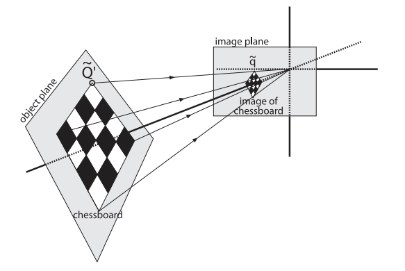

# 4.5 张正友标定法

　　在 4.4 DLT 做法中我们为了求解矩阵 $M$，需要知道 4 对点的世界坐标和图像坐标。但图像坐标易得，世界坐标难觅，所以我们在想能否用一些标准尺寸的物体作为世界坐标系中的已知坐标点，张氏标定法通过棋盘格（ChessBoard）作为标志物，因为棋盘格上每一格的尺寸是已知的，也就是说棋盘格上的角点的世界坐标是已知的。

# 1. 坐标系建立

　　张正友标定法将**世界坐标系的原点设定在棋盘的左上角点**，$Z$ 轴垂直于棋盘平面（$XOY$ 平面）。也就是说：世界坐标系是目标物体的自有坐标系，我们站在目标的角度去描述相机的位置，进而获得相机之间的相对关系。

# 2. 平面单应性矩阵求解

　　平面的单应性定义为：从一个平面到另一个平面的投影映射。

　　

　　上面的 `Image plane` 为相机的成像平面，一个二维平面上的点映射到摄像机成像仪上，就是平面单应性的例子。以张正友标定法中的棋盘格为例，**通过拍摄一组在小范围内变换姿态的棋盘格，可以获得一组单应矩阵** $H$ ，可以解决以下问题。

* 表述真实世界中一个平面与对应它图像的透视变换；
* 得到从世界坐标系到像素坐标系的变换矩阵；
* 通过透视变换实现图像从一种视图变换到另外一种视图

　　**单应性矩阵描述了从物体平面到图像平面的映射，同时表征了这两个平面的的相对位置（物理变换，也就是外参）以及摄像机投影矩阵（内参）**。也就是把原先的 sRT 换了个名字叫做单应矩阵 $H$ 。

$$
\begin{align}
Q &= [x_w, y_w, z_w, 1]^T \\ 
q &= [u, v, 1]^T \\
\therefore q &= s \cdot H \cdot Q \\
\because K &= \begin{bmatrix} 
f_x & 0 & u_0 \\ 
0 & f_y & v_0 \\
0 & 0 & 1
\end{bmatrix}, RT = [R \ | \ T]
\\
\therefore H &= K \cdot RT
\end{align}
$$

　　因为棋盘格是我们的世界坐标系，而且所有的世界点都在棋盘所在的平面，所以 $z_w = 0$ 。那么我们把矩阵 $RT$ 写成列向量的形式，如下所示：

$$
\begin{align}
\begin{bmatrix}
u \\ v \\ 1
\end{bmatrix} &= s \cdot K \cdot \begin{bmatrix}
\vec{r_1} & \vec{r_2} & \vec{r_3} & \vec{t}
\end{bmatrix} \cdot \begin{bmatrix}
x \\ y \\ 0 \\ 1
\end{bmatrix} 
\\
&= s \cdot K \cdot \begin{bmatrix}
\vec{r_1} & \vec{r_2} & \vec{t}
\end{bmatrix} \cdot \begin{bmatrix}
x \\ y \\ 1
\end{bmatrix} = s \cdot H \cdot \begin{bmatrix}
x \\ y \\ 1
\end{bmatrix}
\end{align}
$$

　　单映矩阵 $H$ 的维度就从 $3 \times 4$ 变成了 $3 \times 3$。接下来就是已知 $[u,v], [x,y]$ 来求解矩阵 $H$ 。这个方程和 4.4 中 DLT 的形式一致，所以可以用 DLT 的方法来求解。一对点可以提供 3 个方程，那么 3 对点就能提供 9 个方程了，所以用 3 对点就能计算出单应矩阵 $H$。在这个结果的基础上，张正友标定法的另一个重要之处是**估计相机的内参**，接下来我们看如何操作。

　　对于矩阵 $H$ 的前两列，可以写成：

$$
\begin{align}
\because [\vec h_1, \vec h_2] = [K \vec{r_1}, K \vec r_2] \\
\therefore \vec r_1 = K^{-1} \vec h_1,  \vec r_2 = K^{-1} \vec h_2 \\
\end{align}
$$

　　因为旋转矩阵中 $\vec r_1$ 和 $\vec r_2$ 正交，所以 $\vec r_1^T \cdot \vec r_2 = 0$ ，把上面的两个表达式代入这个式子。

$$
\begin{align}
(K^{-1} \vec h_1)^T K^{-1} \vec h_2 = 0 \\
\vec h_1^T K^{-T} K^{-1} \vec h_2 = 0
\end{align}
$$

　　上面这个式子中有内参矩阵的逆，可以通过初等变换的方法求解 $[P | E] \rightarrow [E | P^{-1}]$ 。那么根据内参矩阵的形式可写出逆矩阵：

$$
\begin{align}
K^{-1} &= \begin{bmatrix}
\frac{1}{f_x} & 0 & -\frac{u_0}{f_x} \\
0 & \frac{1}{f_y} & -\frac{v_0}{f_y} \\
0 & 0 & 1
\end{bmatrix}
\\
\therefore K^{-T} K^{-1} &= \begin{bmatrix}
\frac{1}{f^2_x} & 0 & -\frac{u_0}{f^2_x} \\
0 & \frac{1}{f^2_y} & -\frac{v_0}{f^2_y} \\
-\frac{u_0}{f^2_x} & -\frac{v_0}{f^2_y} & 1
\end{bmatrix}
\end{align}
$$

　　对方程（11），已知 $\vec h_1, \vec h_2$ ，上式中有四个未知数 $f_x, f_y, u_0, v_0$，需要四个方程。但是如果展开方程（11），就会发现只能写出三个。这应该怎么做呢？

　　上面的过程是估计相机的内参，所以在选点用 DLT 计算单应矩阵 $H$ 时，选的点不一样，得到的 $H$ 自然也是不一样的。根据上面单应矩阵的求解需要三对点，就能确定一个 $H$，对于棋盘来说再提供另外三队点又能求出来 $H'$，这两个能提供 6 个方程，求解上面四个变量是个超定问题。这是一个优化问题，已不是单纯的方程求解问题了。

　　另外地，关于分解单应性矩阵得到内外参的方法称为 QR 分解：将满秩的单应矩阵分解得到一个上三角阵和一个正交阵。

　　有关[单目视觉标定法的详细介绍](https://www.cnblogs.com/zhazhiqiang2018/p/9537663.html#_Toc3638)，[双目视觉标定（设计对极几何知识）](https://www.cnblogs.com/zhazhiqiang2018/p/9538986.html)。

　　
