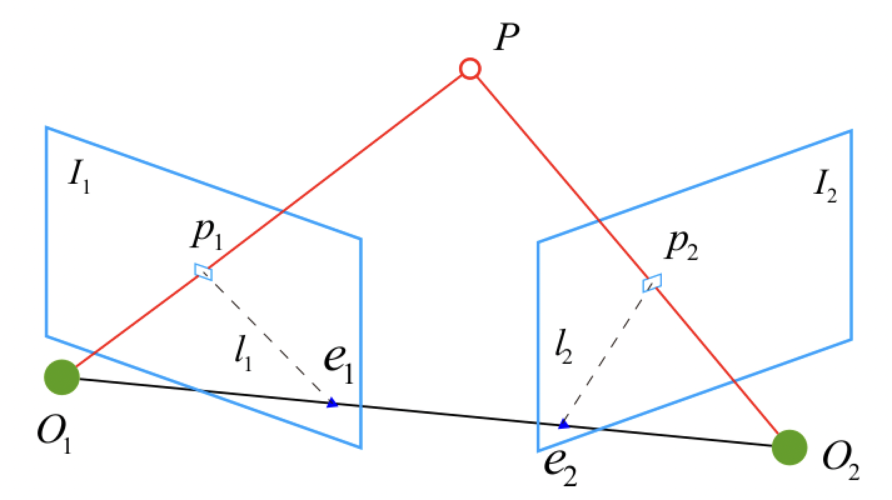

# 5.3 三角化求解世界点

　　通过下图来看如何通过三角化的方法求解世界点 P 的世界坐标。

　　

　　根据相机成像模型，我们有下式成立，我们记内外参矩阵为投影矩阵 $T$  

$$
\begin{align}
z_{c}\left[\begin{array}{l}
u \\
v \\
1
\end{array}\right]=K \cdot\left[\begin{array}{cc}
R & T
\end{array}\right] \left[\begin{array}{c}
x_{w} \\
y_{w} \\
z_{w} \\
1
\end{array}\right] = T \left[\begin{array}{c}
x_{w} \\
y_{w} \\
z_{w} \\
1
\end{array}\right]
\end{align}
$$

　　我们假设已知对应点对 $P_{1,2}$ 的坐标为 $p_1 = (u_1, v_1, 1), p_1 = (u_2, v_2, 1)$ ，真实点 $P$ 的物理坐标为 $p_w = (X_w, Y_w, Z_w, 1)$，这是我们要求。根据推导本质矩阵的思路，把相机 $O_1$ 作为世界坐标系（即相机坐标系和世界坐标系重合），那么可以写出：

$$
\begin{align}
T_1 &= K_1 \cdot [I | 0] \\
T_2 &= K_2 \cdot [R | t]
\end{align}
$$

　　相机坐标和世界坐标之间的关系为：

$$
\begin{align}
p_1 &= \frac{1}{s_1} \cdot T_1 \cdot p_w \\
p_2 &= \frac{1}{s_2} \cdot T_2 \cdot p_w 
\end{align}
$$

　　理论上来说，世界点在成像面上投影 $T \cdot p_w$ 和像素点 $p$ 是重合的，所以它们的叉乘为零。我们以第一个为例，$T_{11}$ 代表投影矩阵 $T_1$ 的第一行，所以结果为：

$$
\begin{align}
\because p_1 \times (T_1p_w) &= [p_1]_{\text{x}} 0 \\
\therefore \begin{bmatrix}
 0 & -1 & v_1 \\
 1 & 0 & -u_1 \\
 -v_1 & u_1 & 0
\end{bmatrix} \cdot \begin{bmatrix}
T_{11}p_w \\
T_{12}p_w \\
T_{13}p_w
\end{bmatrix} &= 0
\end{align}
$$

　　由于 $[p_1]_{\text{x}}$ 的秩为 2，所以一定有一个方程是多余的，我们一般选前两个。这是 $p_1$ 的情况可以得到两个方程，对于 $p_2$ 也可以得到两个方程。方程中内外参，$p_{1,2}$ 的坐标等都是已知量，就能求得未知量 $p_w$ 。

　　在本质矩阵分解中，我们知道 $RT$ 有 4 种情况，之前说代入 100 个点，经过三角化求解出世界点的坐标后，判断大部分是否都在相机站台，就是我们要找的外参。
