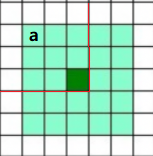

# 6.1 卷积

　　卷积反映的是之前所有时刻的作用 $f$，经过 $g$ 的消减或增强后，在某一时刻时所有。

# 1. 信号的卷积

　　对于线性时不变系统（LTS），引入冲激函数 $\delta(n)$，其系统响应为$h(n)$可以把输入信号 $x$ 进行离散化，其输入和输出满足：

$$
\begin{align}
x(n) &= \sum_{k=-\infty}^{\infty} \delta(n-k) x(k) \\
y(n) &= T[x(n)] = \sum _{k=-\infty}^{\infty} T[\delta(n-k) x(k)] \\
&= \sum _{k=-\infty}^{\infty} x(k) T[\delta(n-k)] \\
&= \sum _{k=-\infty}^{\infty} x(k) h(n-k)
\end{align}
$$

　　式（3）中直接把 $x(k)$ 提出来的原因是在表达式中其为常数，所以可以直接从 $T$ 中提取出来。上面是离散情况，对于连续只需要把 $\sum$ 换成 $\int$ 即可。

# 2. 图像的卷积

　　

　　绿色部分为卷积核，白色部分为图像。如何形象地理解图像的卷积？图像卷积中最常用的是高斯卷积核，其特点是中心为 1，周围随着半径衰减。我们以此为例。

　　每个位置的像素值就像一个蜡烛的亮度，那么它对周围空间的光强影响自然是随着半径的增加而衰减的。比如中间深绿色便为当前蜡烛，它在位置 a 的光强就是深绿色位置处的强度乘以卷积核中位置 a 的衰减倍数即可。

　　反过来，现在我们要计算深绿色位置处的光强，它的光强是除了它之外所有位置的光强叠加，比如蜡烛 a 的强度在深绿色处的光强，首先要把卷积核的中心移到位置 a ，此时如图中红色所示，那么它在深绿色处的光强，就是要用蜡烛 a 的强度，乘以卷积核中深绿色位置的衰减倍数。其他位置类似。

　　表现在运算中：正好是把卷积核沿水平和竖直两个方向翻转后，再叠到图像上，对应位置相乘再相加。

　　
