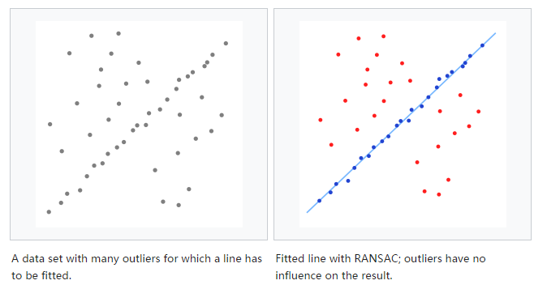
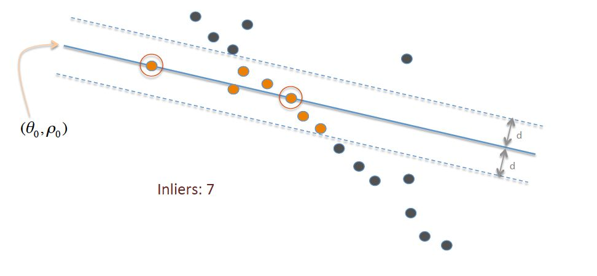

# 6.2 RANSAC

　　参考资料：[随机抽样一致 RANSAC: Random Sample Consensus](https://zhuanlan.zhihu.com/p/36301702)

# 1. 算法描述

　　随机抽样一致（RANSAC）是一种通过**使用观测到的数据点来估计数学模型参数的迭代方法**。其中数据点包括 inlier，outlier。outlier 对模型的估计没有价值，因此该方法也可以叫做 outlier 检测方法。这是一种非确定性算法，因为它是在一定概率下得到一个合理的结果，当迭代次数增加，概率也会增加。此 RANSAC 算法在 1981 年由 Fischler 和 Bolles 首次提出。

　　最基本的假设便是数据中是有 inlier，例如：其可以用一些参数模型来描述，尽管可能有些微噪音，以及 outlier 不能用模型拟合。outlier 一般噪音极大或者由不正确的假设得到的错误测量。RANSAC 同时也假设在给定的 inlier 情况下，存在一个过程可以估计好参数模型并且可以很好地拟合这些数据。

　　一个简单的例子便是在两个方向上拟合直线，其中包括 inlier（可以被拟合直接），outlier（不可以拟合直线），**最小二乘法这里便不适用，因为它会为拟合所有点，而 RANSAC 却只仅适用 inlier 来计算拟合**。这由一些数据的随机样本来拟合线性模型以及找到其中有最好拟合的数据子集。因为 inliers 更倾向有线性相关性（这里）相对混有 outlier 的子集，所以前者会有最好的拟合。实际上，并不能保证 inliers 的子集是随机样本，以及算法的成功概率取决于 inliers 的组成和一些算法参数的选择。

　　

# 2. 步骤

　　RANSAC 算法是一个学习的技巧，通过使用观测数据的随机样本来估计模型参数。**RANSAC 使用投票机制来寻找优化的拟合结果。每个数据元被用来投票一或多个模型**。投票机制基于两点假设：

* 噪音大的特征并不能一直单独为某个模型投票；
* 有足够多的特征来拟合一个好的模型

　　一般 RANSAC 算法由两步骤迭代计算：

* 一个样本子集，包含数据选取（随机选取）。通过使用这些数据得到一个拟合模型和相关的模型参数。样本子集的数量是最小充分的得到模型参数。
* 算法检查数据集中的哪些元素是一直在第一步估计到的模型当中的。如果在阈值（相对噪声的最大偏离度）外的话，该模型元素不能拟合估计到的模型便会被当做 outlier。

　　inliers 的设置称作“一致性设置”，RANSAC 算法会一直迭代直到获得足够的 inliers。

　　RANSAC 的输入是一些观测数据和一些“可信度”参数，实现步骤：

　　（1）随机选择一些原始数据，叫作假设 inliers 子集

　　（2）建立模型拟合

　　（3）用其他数据来验证，根据模型特定的 loss-function 来计算是否符合该模型

　　（4）如果足够的点都算是“一致性”设置里则该模型算是好模型

　　（5）比较所有的“一致性”设置（就是建立的所有模型）看看哪个 inliers 多就是我们要的。

　　

# 3. 数学描述

　　模型 $t$

* 宣称模型拟合满足的数据数量 $s$（基于应用需求和实验估计）。比如拟合一条直线需要两个点，那么 $s=2$ 。
* 迭代次数 $N$；
* RANSAC 算法只选到 inliers 的概率 $p$（从数据集中选择 n 个点）；
* 每次选择选到 inlier 点的概率 $w$ = inliers 的数量/总数据集。

　　一般 $w$ 不是提前知道的，但可以大概估计。假设需要 n 个点独立选择来估计模型，$w^n$ 是 n 个点都是 inliers 的概率，$1-w^n$ 便是至少有一点是 outlier（即该模型是坏模型），则 $(1-w^n)^N$ 便是模型永远选不到不包含 outlier 的模型也即是 $1-p$，则有：

$$
\begin{align}
1-p &= (1-w^n)^N \\
\therefore N &= \frac{\log (1-p)}{\log (1-w^n)}
\end{align}
$$

　　此时假设 n 之间相互独立，即同次迭代中不会被选中两次。如果没有这种机制这便不是一个合理的方法来找到一个作为上限 $k$ 。最极端的便是估计直线，两个点必须不一样。

　　为了获得额外的“可信度”，标准差为 $SD(k)=\frac{\sqrt{1-w^n}}{w^n}$  

# 4. 优缺点

　　RANSAC 算法的有点事鲁棒性好，即使有不小程度的 outliers 存在也能够估计模型参数。缺点便是其计算参数没有时间上限（除了“疲劳”）当迭代次数被限制时，得到的可能便不是最优的，甚至可能很差。一般的 RANSAC 的权衡是：随着计算次数增加，模型一般会更好。但 RANSAC 并不能一直寻找到最优集（但当 inliers 小于 50% 的时候往往表现很差）

　　Optimal RANSAC 算法也因此提出，即使在重污染数据集中（inliers 小于 5%），另一个缺点是 RANSAC 必须要设置一个阈值。

　　还有就是 RANSAC 一次只能估计出一个模型，如果两个（或更多）的模型例子存在，RANSAC 并不能寻找到，此时可以用霍夫变换来替代。当然也可以使用 PEARL（数据样本与 RANSAC 类似，但形成的是多模型）。

　　
